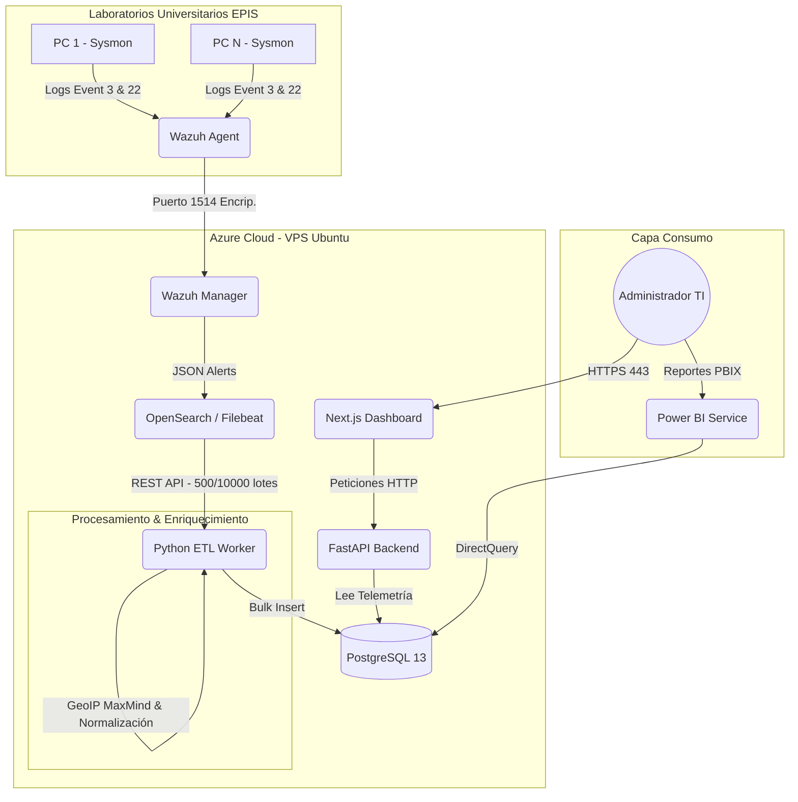

# 🛡️ NetSight - Sistema de Telemetría y Ciberseguridad para Laboratorios de Cómputo

---

## 🎓 Información Académica e Institucional

*   **Universidad:** Universidad Privada de Tacna (UPT)
*   **Facultad:** Facultad de Ingeniería (FAING)
*   **Escuela Profesional:** Escuela Profesional de Ingeniería de Sistemas (EPIS)
*   **Curso:** Inteligencia de Negocios (SI885)
*   **Docente:** Mag. Patrick Cuadros Quiroga
*   **Integrantes (Desarrolladores):**
    *   Renzo Antonio Antayhua Mamani (Código: `2022073504`)
    *   Joan Cristian Medina Quispe (Código: `2022074255`)
*   **Ubicación y Año:** Tacna – Perú, 2026

---

## 📝 Descripción del Proyecto

**NetSight** es una plataforma unificada y distribuida de telemetría, observabilidad y ciberseguridad a nivel de terminales (*endpoints*). Ha sido diseñada específicamente para auditar, analizar e identificar patrones de comportamiento de red dentro de la red de laboratorios informáticos de la **EPIS-UPT**.

El sistema recopila metadatos a nivel de kernel en tiempo real sin interferir con las clases, procesándolos mediante un pipeline de extracción, transformación y carga (ETL). La información enriquecida se centraliza en una base de datos relacional para alimentar reportes avanzados en **Power BI (DirectQuery)** y un centro de control administrativo web en **Next.js**.

### 🎯 Objetivos de Negocio
*   **Ciberseguridad y Threat Hunting:** Detección de conexiones anómalas (puertos de riesgo, IPs sospechosas de exfiltración de datos, etc.).
*   **Control Académico:** Identificación de uso de software o actividades no autorizadas durante sesiones de clase (ej. criptominería, descargas P2P, juegos en red).
*   **Operaciones de TI:** Inventario activo y monitoreo del estado de conexión de las terminales en tiempo real para optimización de recursos y presupuestos de red.

---

## 📐 Arquitectura General del Sistema

El sistema opera bajo una arquitectura orientada a eventos para capturar y procesar el tráfico de los laboratorios sin sobrecargar el hardware de red:



---

## 🚀 Tecnologías Utilizadas

*   **Seguridad y Captura de Eventos:** Sysmon (Event ID 3 - NetworkConnect, Event ID 22 - DnsQuery), Wazuh HIDS (Agent & Manager).
*   **Data Pipeline / ETL:** Python 3, FastAPI, PostgreSQL (psycopg2 Bulk Loading), MaxMind GeoLite2 (Geolocalización).
*   **Almacenamiento:** PostgreSQL 13 (Esquema estrella desnormalizado mediante vistas lógicas).
*   **Despliegue e Infraestructura:** Terraform, Microsoft Azure, Docker / Docker-Compose, Linux Ubuntu Server 22.04 LTS.
*   **Visualización y Analítica:** React, Next.js 15 (App Router), Tailwind CSS, Microsoft Power BI Embedded (DirectQuery).
*   **CI/CD:** GitHub Actions.

---

## 📦 Estructura del Repositorio

*   [**`/infrastructure`**](./infrastructure): Scripts de infraestructura y base de datos.
    *   [`/terraform`](./infrastructure/terraform): Código para desplegar la máquina virtual y red en Microsoft Azure.
    *   [`schema.sql`](./infrastructure/schema.sql): Esquema relacional inicial para PostgreSQL.
    *   [`deploy_wazuh.sh`](./infrastructure/deploy_wazuh.sh): Script Bash para auto-configurar el clúster de Wazuh, base de datos y dependencias en el servidor.
*   [**`/server`**](./server): Código del backend FastAPI.
    *   [`/app/etl`](./server/app/etl): Lógica del motor ETL (`engine.py`), sincronización de estados (`sync_agents.py`) y limpieza (`housekeeping.py`).
    *   [`main.py`](./server/app/main.py): Definición de los endpoints REST de administración y ejecución de jobs.
*   [**`/dashboard`**](./dashboard): Frontend SPA en Next.js 15 para la administración e integración analítica.
*   [**`/installer`**](./installer): Instalador cliente en C# WPF para desplegar la telemetría en laboratorios en un clic.
*   [**`/docs`**](./docs): Informes técnicos formales y blueprints de diseño analítico.

---

## 🛠️ Instrucciones de Despliegue Rápido

### 1. Servidor e Infraestructura (Azure + Terraform)
1. Instalar Terraform y Azure CLI en su máquina local.
2. Iniciar sesión en Azure: `az login`.
3. Navegar a [**`/infrastructure/terraform`**](./infrastructure/terraform).
4. Inicializar y aplicar el aprovisionamiento:
   ```bash
   terraform init
   terraform apply -auto-approve
   ```
5. Tras completarse, el script de inicialización [`deploy_wazuh.sh`](./infrastructure/deploy_wazuh.sh) configurará de forma automatizada los servicios en la VM.

### 2. Backend FastAPI
1. Ingresar a [**`/server`**](./server).
2. Crear y activar un entorno virtual:
   ```bash
   python -m venv venv
   source venv/bin/activate  # En Windows: venv\Scripts\activate
   ```
3. Instalar las dependencias y ejecutar:
   ```bash
   pip install -r requirements.txt
   uvicorn app.main:app --host 0.0.0.0 --port 8000 --reload
   ```

### 3. Frontend Next.js
1. Ingresar a [**`/dashboard`**](./dashboard).
2. Instalar paquetes y ejecutar en modo desarrollo:
   ```bash
   npm install
   npm run dev
   ```

---

## 📊 Inventario de Artefactos Analíticos (EDA & BI)

Se ha creado un conjunto completo de artefactos para el almacenamiento, procesamiento y análisis exploratorio/predictivo del tráfico de red:

### 1. Modelado de Datos y Análisis Predictivo
*   [**`exploratory_analysis.py`**](./server/app/etl/exploratory_analysis.py) [Python Script]: Script de Python que conecta con la base de datos relacional para cargar datos e implementar un modelo predictivo de regresión lineal. Proyecta el tráfico diario de red e inyecta la información en un libro de Excel y JSON.
*   [**`reporte_analisis_exploratorio.xlsx`**](./docs/reporte_analisis_exploratorio.xlsx) [Excel WorkBook]: Libro consolidado con pestañas dedicadas al histórico de volumen diario, proyecciones a 7 días con límites de confianza, uso de aplicaciones (procesos) y resumen general de KPIs.
*   [**`datos_analisis.json`**](./docs/datos_analisis.json) [JSON Metadata]: Archivo JSON estructurado con la ecuación paramétrica del modelo predictivo y las coordenadas de proyección para consumo dinámico.
*   [**`schema.sql`**](./infrastructure/schema.sql) [SQL Schema]: Archivo SQL con las llaves, relaciones, vistas desnormalizadas e índices de PostgreSQL.

### 2. Gráficos y Visualizaciones Generadas
*   [**`plot_proyeccion_trafico.png`**](./docs/plot_proyeccion_trafico.png) [PNG Image]: Gráfico de la serie de tiempo histórica de telemetría de red, línea de tendencia ajustada y proyecciones de volumen diario con un intervalo de confianza al 95%.
*   [**`plot_distribucion_protocolo.png`**](./docs/plot_distribucion_protocolo.png) [PNG Image]: Gráfico de barras con la distribución porcentual de protocolos en la red de laboratorios.
*   [**`plot_top_procesos.png`**](./docs/plot_top_procesos.png) [PNG Image]: Histograma de procesos que revela los ejecutables más activos.

### 3. Publicación en la Nube (Power BI Service)
*   **Enlace de Publicación Web Directa:** [Dashboard Interactivo NetSight - Power BI](https://app.powerbi.com/view?r=eyJrIjoiYTNkOWQ2OTktODYzMS00NGNkLWJjZGItYjg0ZGI2MGY1OTQ0IiwidCI6Ijg1MWIxNWUyLTlkMzMtNDBiMi1hYzkyLTcxMDNhYWM5ZThiZCIsImMiOjR9)  
    *El tablero consume la telemetría depurada a través de las vistas estructuradas de PostgreSQL mediante DirectQuery, permitiendo el desglose interactivo de ciberseguridad, uso académico y capacidad de red.*

---

## 📚 Documentación Técnica de Fases (Fichas Entregables)

Para detalles profundos y especificaciones de ingeniería, consulte los entregables formales de fase:

1.  [**FD01: Informe de Factibilidad**](./docs/FD01-EPIS-Informe%20de%20Factibilidad.md) - Análisis técnico, de riesgos y retorno financiero.
2.  [**FD02: Informe de Visión**](./docs/FD02-EPIS-Informe%20de%20Vision.md) - Perfil de involucrados, limitaciones y alcance.
3.  [**FD03: Especificación de Requerimientos**](./docs/FD03_Requerimientos.md) - Casos de uso de negocio y requerimientos funcionales/no funcionales.
4.  [**FD04: Informe de Arquitectura de Software**](./docs/FD04-EPIS-Informe%20Arquitectura%20de%20Software.md) - Tácticas de disponibilidad y diagramas físicos/lógicos.
5.  [**FD05: Informe de Proyecto Final**](./docs/FD05-EPIS-Informe%20ProyectoFinal.md) - Conclusiones, métricas y resultados de las pruebas de integración.
6.  [**Resumen Técnico General del Proyecto**](./docs/resumen_general.md) - Auditoría a profundidad de cada componente y oportunidades de mejora del software.
