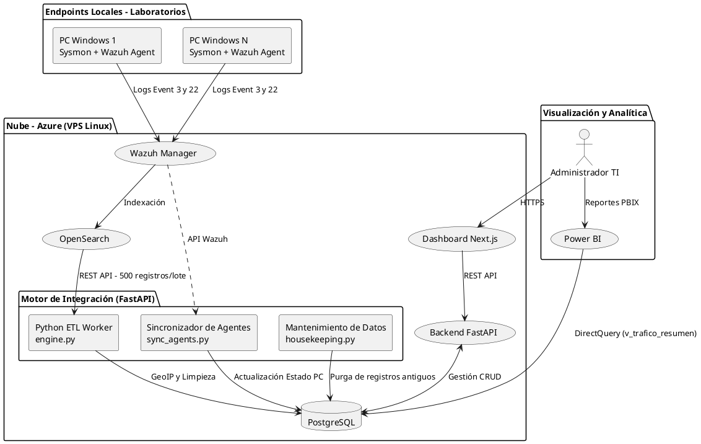

# Documentación de Arquitectura: NetSight - Sistema de Monitoreo de Laboratorio

## 1. Visión General del Proyecto

**NetSight - Sistema de Monitoreo de Laboratorio** es una solución distribuida para el monitoreo de tráfico de red a nivel de terminales (endpoints) en laboratorios de cómputo. Su objetivo es proporcionar observabilidad detallada sobre las conexiones de red (IPv4/IPv6, puertos, protocolos) y el uso de aplicaciones en tiempo real, con un enfoque particular en Ciberseguridad, Control Académico y Operaciones de TI.

El sistema se basa en una arquitectura de recolección de eventos basada en el agente de **Sysmon** y el reenvío mediante **Wazuh Agent**. Los datos fluyen hacia un entorno alojado en la nube (Azure) con un stack ETL programado en Python (FastAPI) que centraliza, transforma y enriquece la información antes de alojarla en una base de datos relacional (**PostgreSQL**). Posteriormente, la telemetría es explotada en **Power BI** a través de modelos *DirectQuery* y un portal web de gestión en **Next.js**.

---

## 2. Diagrama de Arquitectura de Alto Nivel

---

## 3. Infraestructura y Aprovisionamiento (IaC)

La infraestructura en la nube está desplegada a través de procesos automatizados para asegurar reproducibilidad.

- **Terraform (`/infrastructure/terraform`):** Se encarga del aprovisionamiento de un servidor Virtual Private Server (VPS) en Microsoft Azure. Define las configuraciones de red, las llaves SSH (`sysmon_key.pem`) y los grupos de seguridad.
- **Script de Instalación (`deploy_wazuh.sh`):** Instala automáticamente y configura el clúster de Wazuh (Manager, Indexer, Dashboard) sobre Ubuntu. Además, provisiona la base de datos de PostgreSQL e inicializa el esquema a través del `schema.sql`.

### Esquema Base de Datos (`schema.sql`)
La estructura de datos está optimizada para análisis rápido y modelado en estrella (Star Schema) para BI:
- **`laboratorios`**: Almacena información de agrupamiento físico.
- **`computadoras`**: Registra las PC administradas (`hostname`, `ip_local`) y mantiene un estado booleano (`activo`) basado en su estatus de conexión en Wazuh.
- **`trafico_red`**: Almacena conexiones de red (Sysmon ID 3). Registra IPs, puerto, protocolo, e información de Geolocalización (`pais_destino`, `ciudad_destino`), junto con la ruta del archivo ejecutable original (`proceso`).
- **`trafico_dns`**: Registra consultas DNS (Sysmon ID 22) para trazabilidad de dominios.
- **`etl_estado`**: Tabla de control para gestionar el cursor incremental de carga ETL y evitar duplicidad en la extracción desde Wazuh OpenSearch.
- **Vistas Materializadas / Lógicas (`v_trafico_resumen`, `v_trafico_dns_resumen`)**: Capas de presentación para ingestar desde Power BI.

---

## 4. Agente Cliente (C# WPF)

El endpoint se configura a través del instalador ubicado en `/installer/src`. 
Esta es una aplicación de escritorio desarrollada en C# WPF que simplifica el despliegue a una intervención de un solo clic.

**Acciones principales:**
1. Despliega e instala `Sysmon` con una configuración XML especializada que filtra y reenvía el tráfico de red (ID 3) y consultas DNS (ID 22).
2. Instala `Wazuh Agent` y lo inscribe automáticamente en el `Wazuh Manager` de Azure.
3. Se comunica con el backend (FastAPI) para registrar la computadora (`hostname` y `IP local`) bajo el Laboratorio seleccionado en la interfaz del instalador.

---

## 5. Backend y Motor ETL (Python / FastAPI)

El componente principal del servidor (`/server/app/main.py`) expone una API REST moderna. El servidor tiene dos grandes responsabilidades:

### 5.1 Endpoints de Gestión Administrativa
Permiten las operaciones CRUD de laboratorios y computadoras, y son consumidas directamente por el Dashboard en Next.js. También ofrecen endpoints para despachar manualmente los flujos de ETL (`/api/etl/*`).

### 5.2 Motor de Datos (Jobs y ETL)
Para automatizar la extracción de datos de red, el servidor depende de un esquema gestionado a través de Cronjobs en Linux, invocando los endpoints programados:

- **ETL de Tráfico (`engine.py`):** 
  - *Extracción:* Consulta masivamente el OpenSearch (`wazuh-alerts-*`) utilizando un bloque paginado de 500 registros filtrados por el ID de Sysmon, usando el timestamp de `etl_estado` para ser incremental.
  - *Transformación:* Cruza los datos con la base local para validar que la computadora existe en la BD relacional (insensible a mayúsculas y minúsculas). Además, inyecta GeoIP (país y ciudad de destino de la IP).
  - *Carga:* Utiliza un `Bulk Insert` (`execute_values`) para transferir los miles de logs rápidamente a `trafico_red`.
- **Sincronizador de Agentes (`sync_agents.py`):** Se autentica con la API de Wazuh Manager y cruza los "Active Agents" con la base de datos `computadoras` para cambiar dinámicamente el flag de `activo` a true/false. Ejecutado cada 5 minutos.
- **Housekeeping (`housekeeping.py`):** Script de retención para proteger el almacenamiento del disco. Ejecutado cada medianoche, elimina los registros de red con antigüedad mayor a 30-60 días (configurable mediante variables de entorno).

---

## 6. Frontend Dashboard (Next.js)

Ubicado en `/dashboard`, el portal web está construido con React y Next.js. Su propósito es actuar como centro de control para administradores de TI.

**Funcionalidades:**
- Visualización de la topología de laboratorios.
- Panel de inventario mostrando el estado `Activo`/`Inactivo` en tiempo real de cada máquina.
- Estadísticas globales (`/api/stats/`) indicando volumen de tráfico procesado.
- Botones de acción para forzar la sincronización de Wazuh.

---

## 7. Analítica de Inteligencia de Negocios (Power BI)

Basado en el documento `powerbi_blueprint.md`, toda la arquitectura de datos fue diseñada para soportar visualizaciones directas desde Power BI sin requerir modelos complejos DAX intermedios. El blueprint de diseño abarca 3 enfoques o Dashboards principales:

1. **Control Académico y Productividad:**
   - Aprovecha el campo `proceso` introducido desde la ETL para descubrir el uso de software no autorizado en clases (juegos, P2P, proxys).
2. **Operaciones TI y Rendimiento:**
   - Utiliza métricas de conexión por `hostname` y timestamp para perfilar los horarios de mayor uso en cada laboratorio.
3. **Ciberseguridad y Threat Hunting:**
   - Construido a partir de la inyección de `pais_destino` e `ip_destino`, permitiendo visualizaciones de calor geográfico para auditar las conexiones a IPs o países catalogados como riesgosos (ej. tráfico saliente anómalo hacia servidores internacionales desconocidos).
