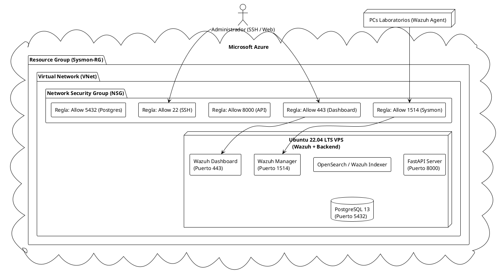
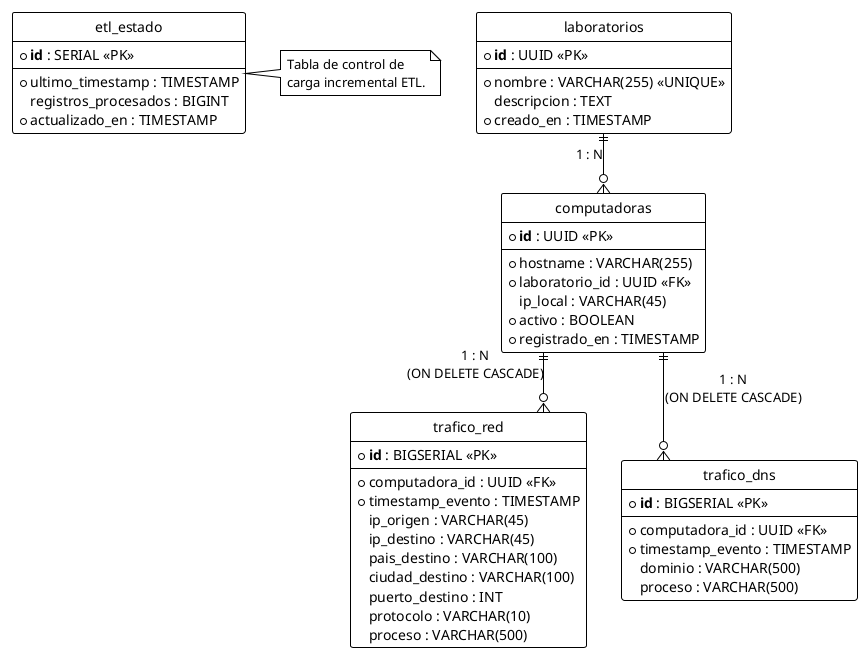
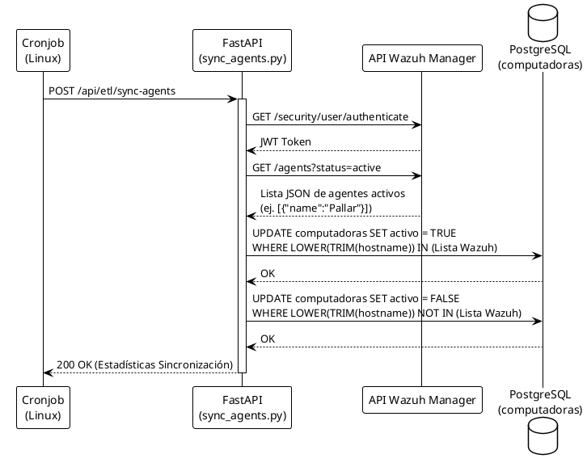

# Documentación Técnica de Infraestructura

Este documento provee un análisis a profundidad sobre los componentes de infraestructura, despliegue y esquema de datos para el proyecto **NetSight - Sistema de Monitoreo de Laboratorio**. Todos los diagramas de este documento están modelados usando código PlantUML.

## 1. Topología de Despliegue (Terraform en Azure)

La infraestructura en la nube está completamente automatizada utilizando Infrastructure as Code (IaC) con Terraform. El código de Terraform (`main.tf`, `variables.tf`) aprovisiona una Máquina Virtual en Microsoft Azure que aloja todo el backend y los contenedores de datos.

### Proceso de Aprovisionamiento
1. **Terraform Apply**: Se crea la máquina virtual y se abren los puertos requeridos en el Security Group de Azure.
2. **`deploy_wazuh.sh`**: Script de inicialización de shell que se ejecuta tras el aprovisionamiento. Sus tareas son:
   - Instalar el Wazuh Manager, Wazuh Indexer y Wazuh Dashboard.
   - Instalar PostgreSQL e importar el esquema inicial desde `schema.sql`.
   - Preparar el entorno Python y correr en background la API FastAPI.

---

## 2. Esquema de Base de Datos Relacional (PostgreSQL)

La capa de persistencia ha sido diseñada con un esquema estrella ("Star Schema") modificado para el modelado en Power BI, y cuenta con llaves foráneas y eliminación en cascada para facilitar la gestión del estado de los agentes.

### Diagrama Entidad-Relación (ERD)

### Detalles Técnicos del Esquema
- **Gestión del Historial:** La tabla `computadoras` usa el campo `activo` para evitar borrar la PC si se desconecta, previniendo que el `ON DELETE CASCADE` borre el historial valioso de `trafico_red` y `trafico_dns`.
- **Enriquecimiento ETL:** Los campos `pais_destino`, `ciudad_destino` y `proceso` en `trafico_red` no son capturados como tal desde el log original Sysmon, sino que son inyectados y correlacionados asíncronamente en vuelo por el worker ETL `engine.py`.
- **Rendimiento e Índices:** Se han creado índices tipo B-Tree (`idx_trafico_red_timestamp`, `idx_trafico_red_computadora`) que optimizan enormemente las vistas lógicas como `v_trafico_resumen` al ser consultadas por el modo DirectQuery de Power BI.

---

## 3. Flujo de Sincronización de Agentes (Wazuh <-> Postgres)

Para mantener actualizado el estado booleano de `activo` en las computadoras sin intervención manual, el sistema utiliza el script `sync_agents.py` ejecutado en cronjob (cada 5 minutos).

Este proceso unifica el inventario real del antivirus/HIDS (Wazuh) con el inventario administrativo (PostgreSQL) y automáticamente se refleja en tiempo real dentro del portal en Next.js y los reportes de IT.
