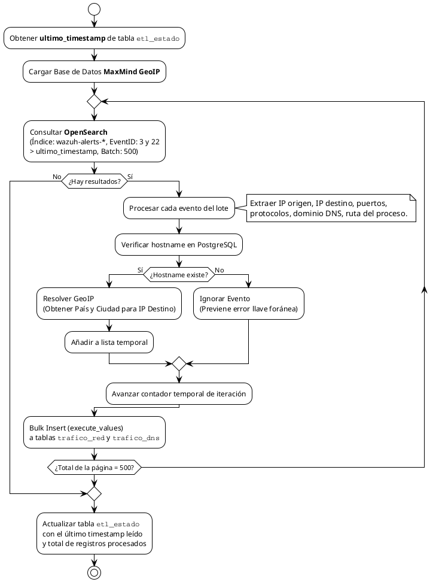
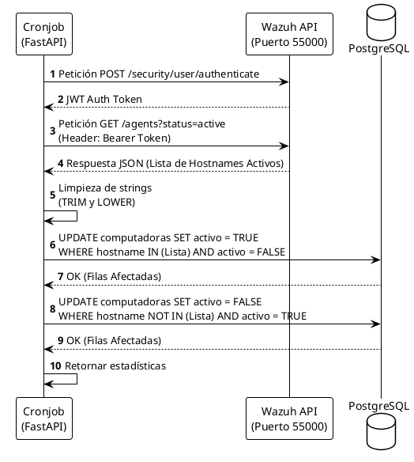
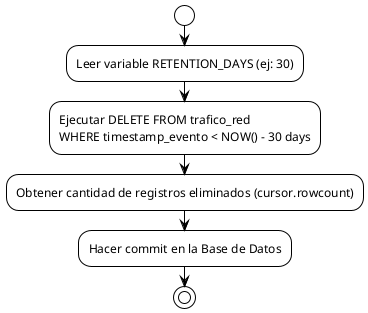

# Documentación Técnica: Backend y Proceso ETL

El servidor Backend del proyecto **NetSight - Sistema de Monitoreo de Laboratorio** está construido utilizando **FastAPI** en Python. Tiene una doble función: por un lado, sirve como API REST para el Dashboard y para el proceso de registro del instalador; por otro, encapsula la lógica de los motores de extracción, transformación y carga (ETL), sincronización y purga de datos.

## 1. Arquitectura de Endpoints (FastAPI)

El archivo `main.py` define la interfaz REST y la interacción con PostgreSQL mediante SQLAlchemy (de forma asíncrona).

### Endpoints Principales
- **CRUD Laboratorios (`/api/laboratorios/`)**: Permite listar, crear, actualizar y eliminar (con cascada) laboratorios físicos.
- **Registro Computadoras (`/api/computadoras/`)**:
  - `GET`: Lista todas las PC junto a su estado activo y laboratorio asignado.
  - `POST`: Expuesto para que el instalador C# registre automáticamente el host (mediante su hostname y dirección IP) durante la instalación de Sysmon/Wazuh.
- **Acciones Administrativas ETL (`/api/etl/*`)**:
  - `/api/etl/sync`: Dispara manualmente la ejecución del motor ETL de tráfico.
  - `/api/etl/sync-agents`: Dispara la validación de actividad entre Wazuh y Postgres.
  - `/api/etl/housekeeping`: Inicia la limpieza de datos antiguos.

---

## 2. Motor ETL de Tráfico de Red (`engine.py`)

Es el componente crítico (Data Pipeline) que asegura que los logs crudos que llegan de Sysmon (mediante Wazuh y almacenados en OpenSearch) se enriquezcan y pasen a la estructura relacional (PostgreSQL) para Power BI. 

### Diagrama de Flujo del ETL

### Principios del `engine.py`:
1. **Incrementalidad**: Evita procesar la misma data dos veces al recordar el último `timestamp` en `etl_estado`.
2. **Eficiencia por Lotes (Bulk Insert)**: Usa `psycopg2.extras.execute_values` para insertar registros de a 500 de golpe, bajando drásticamente el costo computacional sobre Postgres.
3. **Resiliencia Textual**: Implementa normalización `LOWER(TRIM(hostname))` para evitar rechazos por espacios ocultos o diferencias de mayúsculas desde Sysmon Windows.

---

## 3. Sincronización de Agentes (`sync_agents.py`)

Para que el Dashboard muestre métricas fiables de computadoras conectadas (y no incluya terminales que han sido desmanteladas o perdieron su agente), se creó un sincronizador que conversa mediante API nativa con el Wazuh Manager.

### Diagrama de Secuencia de Sincronización

---

## 4. Retención y Limpieza de Datos (`housekeeping.py`)

Debido a que el Event ID 3 de Sysmon genera gran volumen de datos (una PC puede generar miles de conexiones DNS o TCP/UDP por día), el crecimiento de la base de datos PostgreSQL debe controlarse.

- **Mecanismo**: El script elimina mediante una consulta `DELETE` todos aquellos eventos de red (en `trafico_red` y `trafico_dns` por su relación de FK en `computadoras` o mediante cascada si aplica, en este caso directo a `trafico_red`) que sean más antiguos a un límite de tiempo definido (variable de entorno `RETENTION_DAYS`, por defecto **30 días**).
- **Ejecución**: Generalmente configurado vía Crontab del sistema operativo para ejecutarse en horas de madrugada (`0 0 * * *`).

