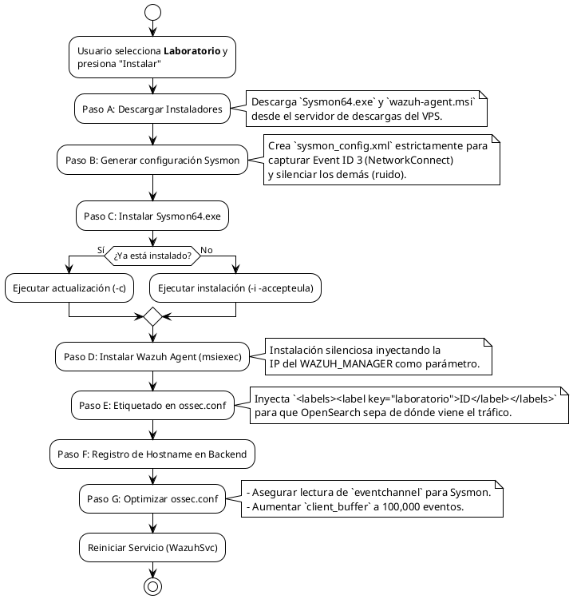
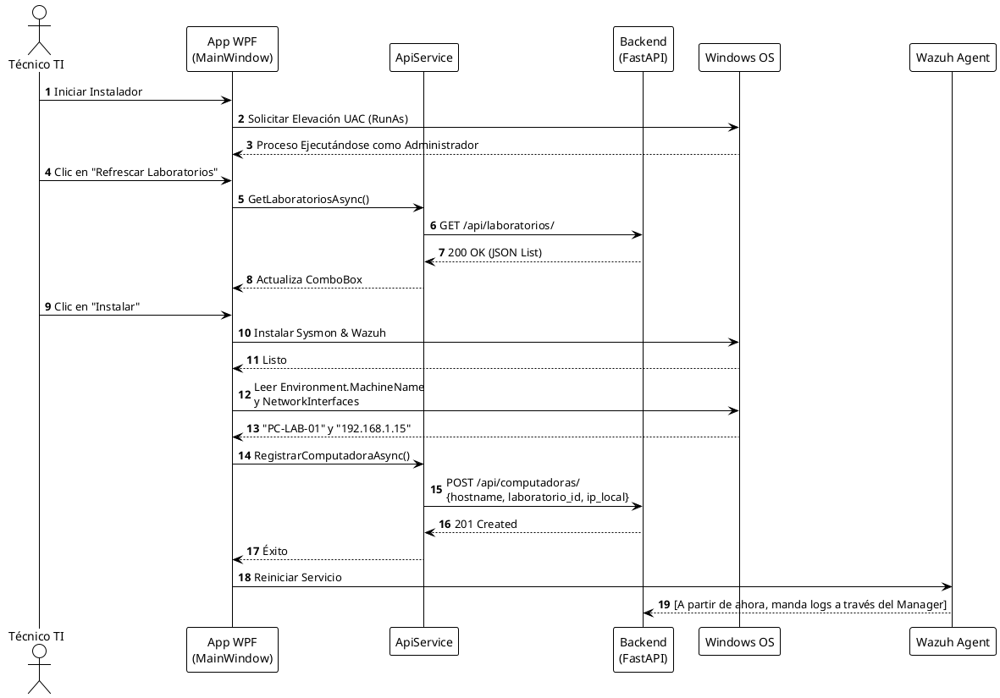

# Documentación Técnica: Agente Cliente (Instalador WPF)

El Agente Cliente está contenido en la solución `NetworkMonitorInstaller` desarrollada en **C# con WPF (.NET)**. Su propósito es reducir a un solo clic (despliegue silencioso) la configuración compleja de los endpoints Windows de los laboratorios, integrando Sysmon, Wazuh Agent y la API Central.

## 1. Arquitectura del Agente

El código está estructurado mediante un patrón de UI y Servicios, donde la vista (`MainWindow.xaml`) orquesta las llamadas a tres servicios principales:
- `SysmonService.cs`: Generación de perfiles XML y ejecución de Sysmon.
- `WazuhService.cs`: Instalación vía MSI, edición XML (`ossec.conf`) y gestión de Windows Services (UAC).
- `ApiService.cs`: Comunicación HTTP con el backend de FastAPI.

---

## 2. Flujo de Instalación

Al hacer clic en el botón "Instalar", el software ejecuta una secuencia determinista para aprovisionar el host.

---

## 3. Diagrama de Secuencia de Comunicación

El instalador no solo despliega software de terceros, sino que debe mantener al backend informado de su existencia para no romper la llave foránea del motor ETL.

---

## 4. Resoluciones Técnicas Clave

### Elevación de Privilegios Automática
El instalador usa el método `WazuhService.ReroutearSiNoEsAdmin()`, el cual verifica el token de `WindowsPrincipal`. Si el usuario no es administrador, la aplicación se reinicia a sí misma solicitando explícitamente el prompt UAC (`Verb = "runas"`).

### XML Parsing de `ossec.conf`
Dado que el archivo de configuración de Wazuh (`ossec.conf`) es altamente estricto, el `WazuhService` utiliza `System.Xml.Linq` para analizar y modificar los nodos `<labels>` y `<client_buffer>` y lo guarda usando una configuración especial (`OmitXmlDeclaration = true` y sin BOM UTF-8) para evitar que el servicio de Wazuh falle al intentar leerlo.

### Filtros de Sysmon
El `sysmon_config.xml` ha sido optimizado para evitar ahogar la red. Usa el enfoque:
- `<NetworkConnect onmatch="exclude" />`: Significa "Si la regla excluye nada, **incluye absolutamente todo**".
- Todo lo demás (ej. `ProcessCreate`, `FileDelete`) utiliza `<... onmatch="include" />` vacío, lo que silencia el evento completamente para el Event Viewer.
