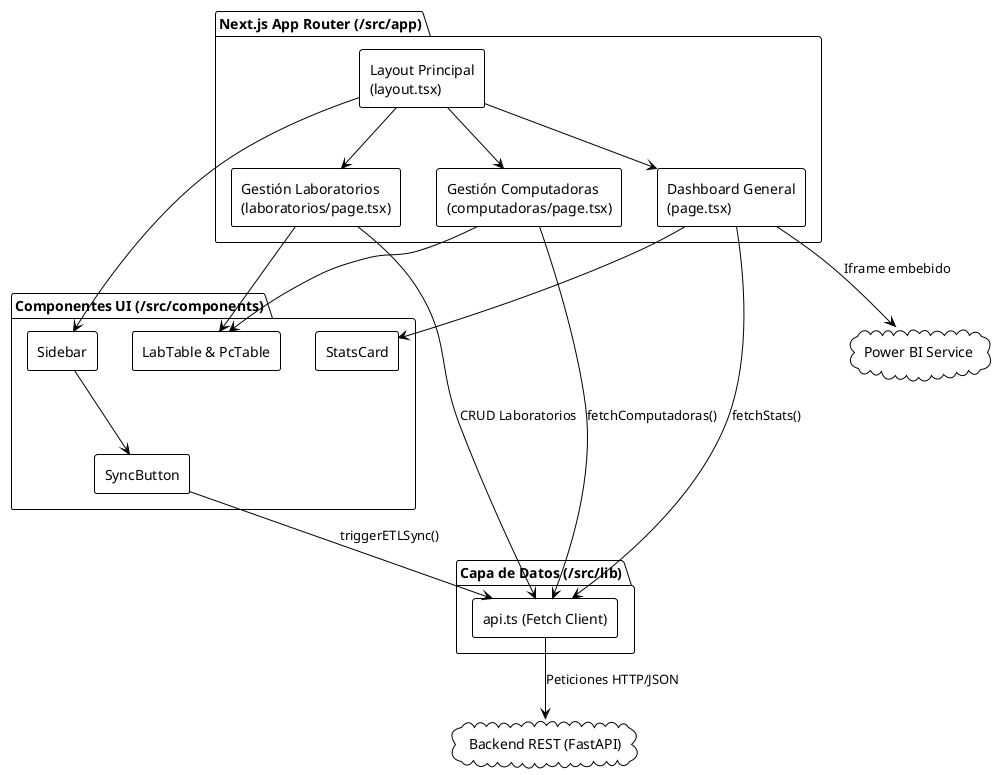
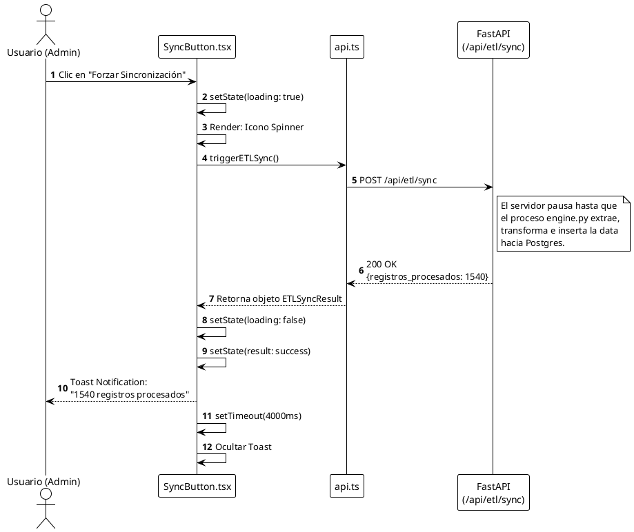

# Documentación Técnica: Frontend Dashboard

El portal administrativo de **NetSight - Sistema de Monitoreo de Laboratorio** ha sido desarrollado en **Next.js 15 (App Router)** y **React 19**, proporcionando una interfaz moderna, rápida y responsiva para la gestión de la infraestructura y visualización de telemetría.

## 1. Arquitectura de Componentes

La aplicación está diseñada usando una arquitectura de componentes funcionales e interactúa de manera asíncrona con el Backend FastAPI a través del servicio encapsulado en `lib/api.ts`.

---

## 2. Vistas Principales

### 2.1 Resumen General (`/`)
Es la vista de aterrizaje (Landing) del administrador. Presenta:
- **Tarjetas de Estadísticas (`StatsCard`)**: Muestra en tiempo real la cantidad de Laboratorios creados, Computadoras registradas y el volumen total de Registros de Tráfico procesados por la base de datos. Se auto-refresca cada 30 segundos.
- **Power BI Embebido**: Despliega un `<iframe allowFullScreen>` apuntando al reporte público en Power BI Service (`app.powerbi.com`), que consume los datos procesados.
- **Botón de Descarga**: Un acceso directo (`/api/download-installer`) para descargar el instalador compilado del agente cliente (C# WPF).

### 2.2 Gestión de Laboratorios (`/laboratorios`)
Permite definir los agrupamientos físicos o lógicos de la infraestructura.
- Se comunica vía `api.ts` para hacer `POST` o `PUT` de la entidad `LaboratorioCreate`.
- Esta vista es esencial ya que, sin laboratorios registrados, el Instalador del Agente Cliente no podrá culminar su instalación.

### 2.3 Inventario de Computadoras (`/computadoras`)
Un listado de solo-lectura (`fetchComputadoras`) que muestra todos los hosts inscritos en la plataforma.
- Visualiza el campo `hostname`, `ip_local`, fecha de registro y el estado de conexión (`activo`), ayudando al personal de soporte a detectar equipos desconectados.

---

## 3. Flujo de Sincronización Manual (SyncButton)

Dado que los flujos de ETL están automatizados por Cronjobs en Linux, se ha provisto un botón estratégico en la cabecera / menú lateral (`SyncButton.tsx`) que permite al administrador forzar la extracción de datos desde OpenSearch hacia PostgreSQL a demanda.

### Diagrama de Flujo y Estados de UI

### Gestión de Errores
El frontend está protegido contra interrupciones en el backend. Si el endpoint de ETL falla (por caída de base de datos o timeout de OpenSearch), el bloque `catch` dentro de `triggerETLSync` capturará el error HTTP, devolviendo un objeto que activará un Toast con la clase `toast-error` notificando la falla sin colapsar la página entera.
