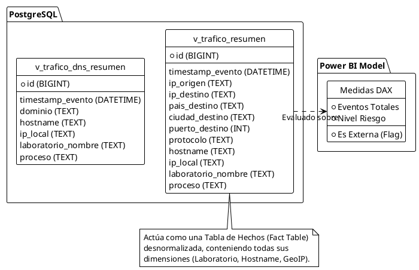

# Documentación Técnica: Inteligencia de Negocios (Power BI)

El objetivo final de **NetSight - Sistema de Monitoreo de Laboratorio** es entregar información procesable a la gerencia, el equipo de soporte técnico y el área de seguridad informática. Toda la información consolidada por el motor ETL se explota a través de tableros interactivos (Dashboards) diseñados en **Microsoft Power BI**.

## 1. Modelo de Datos y Conexión

El modelo de datos se ha simplificado estratégicamente en la base de datos PostgreSQL utilizando vistas consolidadas. En lugar de importar múltiples tablas y realizar los `JOINs` en Power BI (lo que penalizaría el rendimiento en modo tiempo real), se consume directamente la vista `v_trafico_resumen` y `v_trafico_dns_resumen`.

### Diagrama del Esquema Estrella (Consolidado)



### Modos de Conexión Soportados
1. **DirectQuery (Recomendado):** Power BI no almacena los datos en memoria. Cada vez que el usuario interactúa con un gráfico, se envía una consulta SQL al servidor PostgreSQL. Ideal para monitoreo de **Ciberseguridad en Tiempo Real**.
2. **Import Mode:** Para análisis de tendencias históricas de meses pasados donde se privilegia la velocidad de renderizado de la UI.

---

## 2. Fórmulas DAX Avanzadas

El modelo incluye medidas y columnas calculadas (DAX) que le otorgan contexto de negocio a los datos de red crudos:

- **Conteo de Eventos**: Para medir el volumen de tráfico.
  ```dax
  Eventos Totales = COUNT('v_trafico_resumen'[id])
  ```
- **Detección de Tráfico Externo vs Interno (Movimiento Lateral)**:
  ```dax
  Es Externa = 
  IF(
      LEFT('v_trafico_resumen'[ip_destino], 3) = "192" || 
      LEFT('v_trafico_resumen'[ip_destino], 2) = "10" || 
      LEFT('v_trafico_resumen'[ip_destino], 3) = "172", 
      "Interna", 
      "Externa"
  )
  ```
- **Categorización de Puertos Críticos**:
  ```dax
  Nivel Riesgo = 
  SWITCH( TRUE(),
      'v_trafico_resumen'[puerto_destino] IN {21, 22, 23, 3389, 445}, "Crítico",
      'v_trafico_resumen'[puerto_destino] > 1024, "Dinámico/Alto",
      "Estándar"
  )
  ```

---

## 3. Enfoques y Tableros (Dashboards)

De acuerdo al Blueprint oficial, los datos enriquecidos soportan la construcción de tableros específicos orientados a distintos perfiles de decisión:

### T1: Ciberseguridad y Threat Hunting (Seguridad de la Información)
Permite auditar el comportamiento anómalo. Gracias a la inclusión del componente GeoIP en la fase de ETL, este tablero es capaz de detectar conexiones hacia redes botnet o servidores internacionales de riesgo.
- **KPIs**: Conexiones a puertos críticos (RDP 3389, Telnet 23), IPs externas sospechosas.
- **Visuales**: Mapa Mundial de calor de IPs destino (`pais_destino`), Tabla de movimiento lateral cruzando origen y destino interno.

### T2: Control Académico y Uso de Software (Jefes de Laboratorio)
Aprovecha la columna `proceso` capturada por Sysmon para ver exactamente qué aplicaciones generan tráfico.
- **KPIs**: Top 10 Aplicaciones más usadas por laboratorio.
- **Visuales**: Gráficos de barras que evidencian uso de software no autorizado (juegos, clientes P2P/Torrent, software pirata) en horas de clases.

### T3: Operaciones TI e Inventario (Equipo de Soporte)
Mide la utilización real de la infraestructura tecnológica.
- **KPIs**: PCs activas hoy, Porcentaje de carga del laboratorio.
- **Visuales**: Línea de tiempo de PCs conectadas simultáneamente para identificar los horarios pico y justifycar presupuestos de ancho de banda o nuevas adquisiciones.

### T4: Auditoría de Tráfico (Administradores de Red)
Control y mapeo topológico del consumo de la red de área local.
- **Visuales**: Diagrama de Sankey mostrando la ruta `Hostname -> IP Destino -> Puerto`, y un Treemap distribuyendo el % de uso entre protocolos TCP y UDP.
