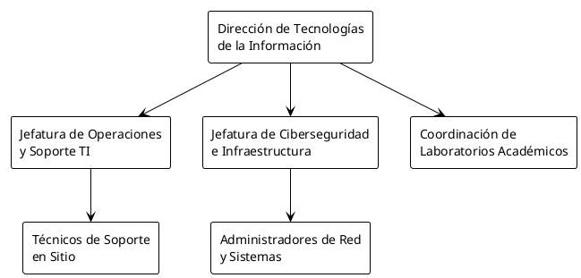
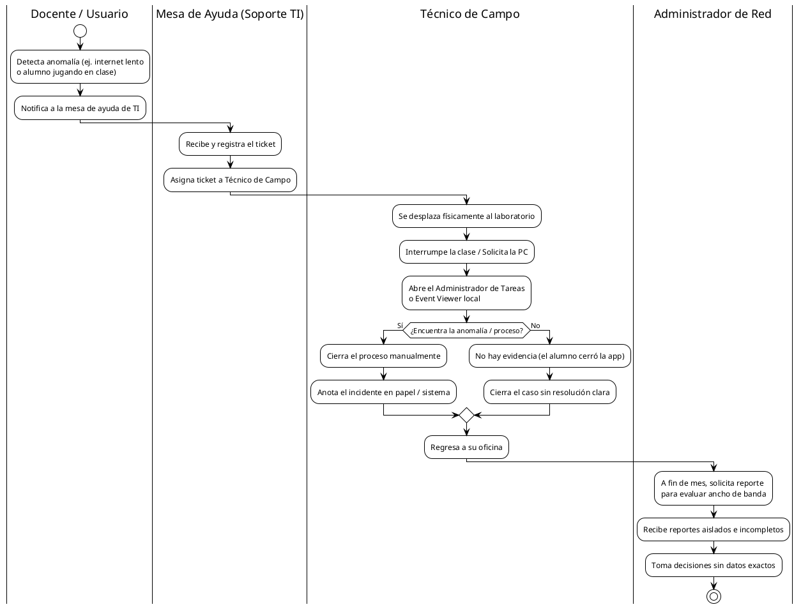
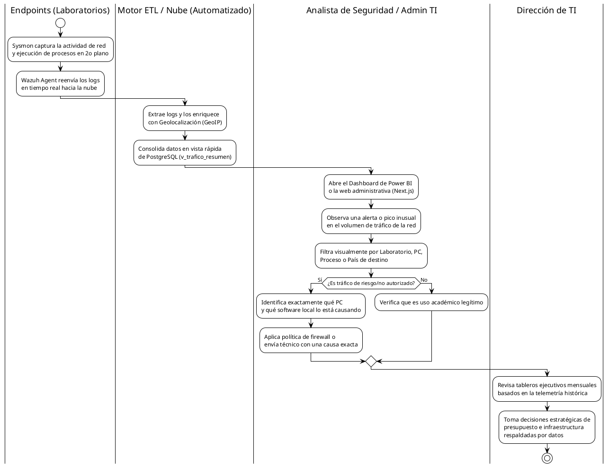
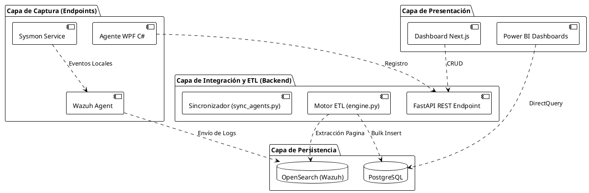
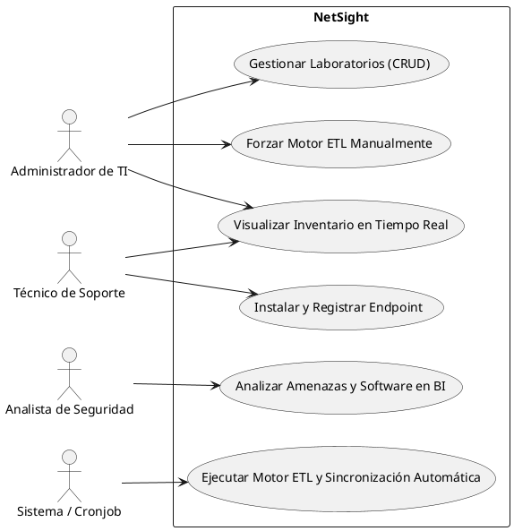
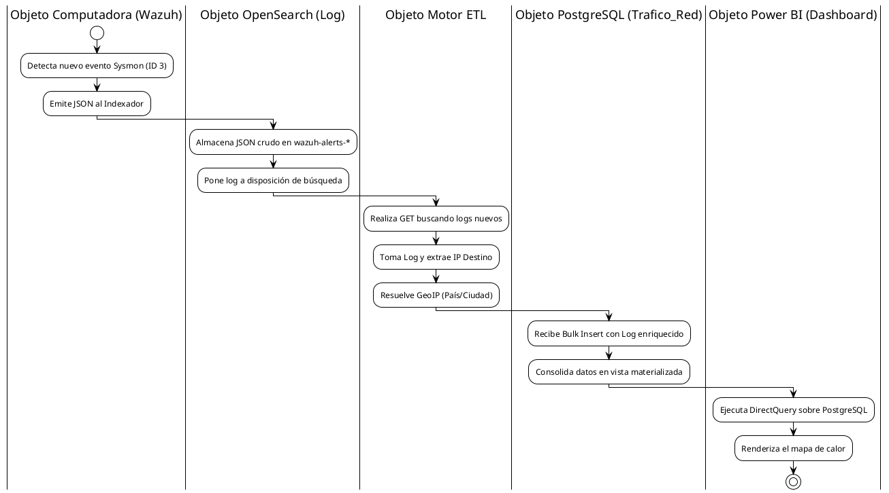
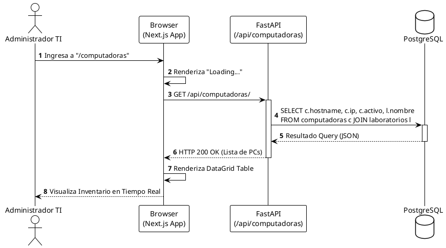
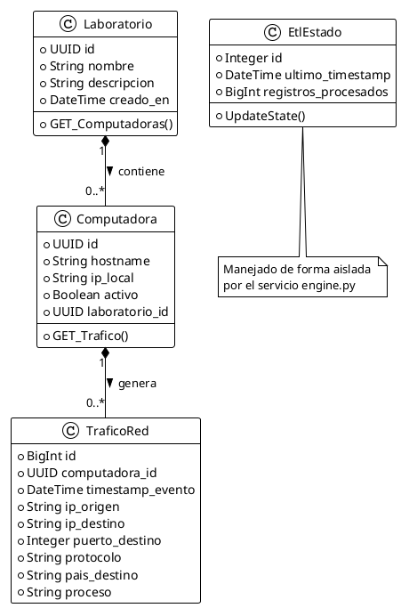

# INTRODUCCIÓN

## I. Generalidades de la Empresa

### 1. Nombre de la Empresa
**Escuela Profesional de Ingeniería de Sistemas (EPIS) - Universidad Privada de Tacna (UPT)** - Departamento de Tecnologías de la Información. 
*(Nota: Puedes sustituir este texto por el nombre real de tu institución).*

### 2. Visión
Ser reconocidos como el departamento líder en innovación y gestión tecnológica, proporcionando un entorno digital seguro, eficiente y de alta disponibilidad que impulse la excelencia académica y operativa mediante el uso de telemetría avanzada e inteligencia de negocios.

### 3. Misión
Proveer a la institución de una infraestructura tecnológica robusta, segura y monitoreada en tiempo real. Garantizar el uso adecuado de los recursos computacionales en los laboratorios mediante soluciones innovadoras que apoyen la toma de decisiones, salvaguarden la integridad de la red y optimicen las operaciones de TI, brindando así un servicio de excelencia a la comunidad estudiantil y administrativa.

### 4. Organigrama
A continuación se presenta el organigrama funcional del Departamento de TI aplicable al contexto de este proyecto:

---

## II. Visionamiento de la Empresa

### 1. Descripción del Problema
Actualmente, la institución administra múltiples laboratorios de cómputo con un volumen significativo de terminales (endpoints). Sin embargo, existe una falta de visibilidad profunda sobre el comportamiento del tráfico de red y el uso real de las aplicaciones dentro de estos equipos. Esto desencadena múltiples problemáticas:
- **Ausencia de Control Académico:** Dificultad para detectar si los equipos se utilizan para fines lúdicos o no autorizados (ej. videojuegos, descargas P2P, proxys) durante los horarios destinados a clases.
- **Riesgos de Ciberseguridad:** Imposibilidad de detectar proactivamente conexiones salientes hacia servidores internacionales maliciosos (botnets) o intentos de movimientos laterales que comprometan la seguridad de la red.
- **Ineficiencia Operativa:** El equipo de soporte técnico carece de un inventario dinámico en tiempo real que indique el estado de conectividad de cada máquina, lo que complica el mantenimiento preventivo y entorpece la capacidad de justificar, de manera sustentada, el uso del presupuesto de TI.

### 2. Objetivos de Negocios
- **Optimizar el Retorno de Inversión (ROI):** Maximizar el uso estrictamente académico y profesional de los recursos tecnológicos, asegurando que las computadoras se empleen en las actividades para las que fueron dispuestas.
- **Fortalecer la Postura de Seguridad Institucional:** Reducir drásticamente la superficie de ataque y el tiempo de respuesta ante incidentes de red mediante monitoreo en tiempo real e inteligencia de amenazas basada en geolocalización.
- **Mejorar la Toma de Decisiones Estratégicas:** Dotar a la alta gerencia y a los coordinadores de tableros de control precisos (Dashboards en Power BI) que fundamenten las decisiones sobre renovación de equipos, incrementos de ancho de banda y horarios de disponibilidad de los laboratorios.

### 3. Objetivos de Diseño
- **Automatización y Despliegue Silencioso:** Desarrollar un instalador (C# WPF) que no requiera intervención humana experta para aprovisionar las reglas Sysmon y el agente Wazuh en Windows.
- **Eficiencia y Escalabilidad Estructural:** Diseñar un motor ETL (Python/FastAPI) que no penalice a la base de datos transaccional, utilizando inserciones en lote (Bulk Inserts) e indexado asíncrono para soportar grandes flujos de eventos.
- **Alta Disponibilidad de Análisis de Datos:** Asegurar que los reportes de Inteligencia de Negocios consuman los datos a través de vistas materializadas directas en PostgreSQL (DirectQuery) sin sacrificar la velocidad de la interfaz.
- **Observabilidad Centralizada:** Agrupar y normalizar datos de naturaleza dispar provenientes de múltiples laboratorios físicos, unificándolos en un único repositorio lógico analizable en múltiples dimensiones.

### 4. Alcance del Proyecto
El alcance general de **NetSight** abarca la implementación completa del ciclo de vida del dato (recolección, procesamiento, almacenamiento y visualización):
- Aprovisionamiento de infraestructura en la nube (Azure VPS) mediante código (Terraform).
- Desarrollo de un motor ETL en Python y una API REST para administración de inventario.
- Diseño y despliegue del Portal Web (Dashboard en Next.js) para monitoreo de estado.
- Creación de la aplicación cliente (WPF) para la instalación y orquestación desatendida del agente Sysmon y Wazuh en las terminales locales.
- Estructuración del modelado de datos relacional y desarrollo de tableros de visualización en Microsoft Power BI.
*(Exclusión: El control activo de los equipos, como apagado remoto, bloqueo de pantalla o desinstalación de programas, queda fuera del alcance, enfocándose el sistema exclusivamente en la telemetría pasiva).*

### 5. Viabilidad del Sistema
- **Viabilidad Técnica:** La arquitectura se basa en tecnologías sólidas, modernas y validadas en el mercado (Next.js, FastAPI, PostgreSQL, Wazuh). El flujo de eventos ya ha sido diseñado considerando la tolerancia a fallos.
- **Viabilidad Operativa:** El sistema reducirá la carga operativa del equipo de soporte. Al automatizar la recopilación y limpieza de los logs, el área de TI dejará de ser reactiva y adoptará una postura proactiva, integrándose de manera natural en los procesos diarios de la mesa de ayuda.
- **Viabilidad Económica:** El sistema se apalanca fuertemente en software Open Source (Wazuh, Python, PostgreSQL), concentrando la necesidad de inversión únicamente en los costos de alojamiento en la nube (Azure) y el licenciamiento de Power BI. Este modelo operativo es altamente costeable y encaja en los márgenes de los presupuestos actuales de TI.

### 6. Información Obtenida del Levantamiento de Información
Tras diversas sesiones de requerimientos y análisis con Jefes de Laboratorio, Analistas de Redes y Personal de Soporte, se extrajo la siguiente información vital que condicionó el diseño del sistema:
- **Ausencia de Centralización Nativa:** Los registros de *Windows Event Viewer* de cada terminal se sobrescriben rápido debido a limitaciones de espacio y no se agrupan en ningún servidor central.
- **Identificación de Puertos Riesgosos:** El área de infraestructura tiene claramente identificados puertos de comunicación críticos (22, 23, 3389, 445) sobre los cuales se requiere una vigilancia rigurosa e implacable.
- **Etiquetado Temprano de Origen:** Se descubrió que la correlación de datos en bases de datos masivas es ineficiente si no se conoce el origen de antemano. Por ello, se requirió que el instalador de WPF inyecte el ID del laboratorio directamente en el archivo `ossec.conf` de Wazuh al momento de la instalación, agilizando todo el trabajo posterior.
- **Protección de Almacenamiento:** Debido a los altos flujos de red (una PC puede generar miles de conexiones en una hora), se solicitó implementar de forma obligatoria un sistema de purga (Housekeeping) automático que elimine datos de red y DNS con antigüedad mayor a 30 días, preservando únicamente la estadística vital en Power BI.

# III. Análisis de Procesos

Esta sección detalla la comparativa entre la forma en la que se gestionan los incidentes y el monitoreo de la red en los laboratorios antes de la implementación del sistema, y la eficiencia operativa lograda a través del proceso propuesto mediante el uso de la telemetría.

## a) Diagrama del Proceso Actual – Diagrama de actividades

En el proceso operativo actual, el personal de TI y soporte no cuenta con visibilidad proactiva. Las auditorías o revisiones de uso de red y aplicaciones en los laboratorios se realizan de manera reactiva, comúnmente disparadas por quejas de lentitud en la red o reportes de uso indebido emitidos por los docentes. El flujo es altamente ineficiente, requiriendo desplazamiento físico y revisión manual de registros volátiles en cada computadora.

**Análisis de Deficiencias del Proceso Actual:**
1. **Alta Latencia de Respuesta:** Entre que ocurre el incidente (como una conexión maliciosa o descarga no autorizada) y el técnico llega físicamente al equipo, la evidencia suele haber desaparecido.
2. **Nula Proactividad:** El departamento de TI depende totalmente de que un humano (docente o alumno) note un problema y decida reportarlo.
3. **Decisiones a Ciegas:** Las direcciones de TI no pueden justificar de forma certera la compra de nuevos equipos de red o el aumento de ancho de banda, ya que no poseen métricas consolidadas sobre el uso real.

---

## b) Diagrama del Proceso Propuesto – Diagrama de actividades Inicial

El proceso propuesto, respaldado por **NetSight**, revoluciona la operatividad de TI convirtiéndola en un área proactiva e inteligente. La captura de datos en segundo plano, orquestada por el pipeline ETL y visualizada en Power BI y el Dashboard en Next.js, permite detectar e investigar anomalías en tiempo real, desde la comodidad del centro de control y con extrema precisión.

**Beneficios del Proceso Propuesto:**
1. **Visibilidad Continua (24/7):** El flujo de información nunca se detiene. Incluso si el estudiante cierra la aplicación indebida antes de que llegue el profesor, el registro inmutable y la ruta exacta del proceso ya se encuentran almacenados en el servidor PostgreSQL.
2. **Enriquecimiento del Contexto Analítico:** Al cruzar las direcciones IP de destino con bases de datos de geolocalización, resulta instantáneo descubrir conexiones sospechosas (por ejemplo, detectar de inmediato comunicaciones no solicitadas hacia Rusia o Asia desde una PC de laboratorio que solo debería consultar servidores locales o académicos).
3. **Optimización Extrema de Tiempos:** El técnico de soporte ya no acude "a ciegas" a diagnosticar un problema de red. Si requiere ir físicamente al sitio, ya sabe de antemano el nombre exacto de la máquina (`hostname`), el proceso implicado (`.exe`) y la hora exacta del incidente.

# IV. Especificación de Requerimientos de Software

En esta sección se detallan los requisitos que el sistema **NetSight** debe cumplir, divididos en funcionales y no funcionales, y acompañados de las reglas de negocio que limitan y dirigen su operación. 

## a) Cuadro de Requerimientos Funcionales Inicial

Este cuadro refleja los requerimientos extraídos en la primera fase de levantamiento de información con los *stakeholders* (Directores de TI y Jefes de Laboratorio), representando las necesidades a muy alto nivel.

| Código | Módulo | Descripción del Requerimiento Inicial | Prioridad |
|:---:|:---|:---|:---:|
| **RFI-01** | Dashboard Web | El sistema debe permitir registrar y visualizar laboratorios y computadoras. | Alta |
| **RFI-02** | Agente Endpoint | El sistema debe recolectar la actividad de red de las computadoras sin interrumpir a los usuarios. | Alta |
| **RFI-03** | Motor ETL | El sistema debe centralizar los logs de red y limpiar la información antes de guardarla. | Alta |
| **RFI-04** | Motor ETL | El sistema debe ser capaz de determinar en qué país está la IP a la que se conectó el alumno. | Media |
| **RFI-05** | Inteligencia de Negocios | El sistema debe contar con tableros visuales para ver qué programas usan los alumnos. | Alta |
| **RFI-06** | Mantenimiento | El sistema no debe llenar el disco duro del servidor con logs antiguos. | Alta |

---

## b) Cuadro de Requerimientos No Funcionales

A continuación, se describen los atributos de calidad, rendimiento, seguridad y disponibilidad que rigen la arquitectura del sistema.

| Código | Categoría | Descripción del Requerimiento | Métrica / Condición de Aceptación |
|:---:|:---|:---|:---|
| **RNF-01** | Rendimiento | El flujo ETL debe procesar logs en lote (*Bulk Insert*) para no bloquear la base de datos PostgreSQL. | Capacidad mínima de procesar 500 registros por segundo sin deadlocks. |
| **RNF-02** | Seguridad | El acceso a los datos de telemetría debe estar estrictamente controlado y la base de datos no debe ser expuesta a internet público. | Uso de Network Security Groups en Azure; acceso exclusivo a la BD vía IP local o SSH Tunnel. |
| **RNF-03** | Optimización Red | El agente de captura Sysmon no debe saturar el ancho de banda del laboratorio enviando logs innecesarios. | Filtro de Event ID: Solo capturar IDs 3 (Network Connect) y 22 (DNS Query). |
| **RNF-04** | Usabilidad UI | La interfaz del Dashboard (Next.js) debe ser responsiva y alertar de errores de conexión de manera amigable. | Implementación de Notificaciones tipo *Toast* y tiempos de carga inferiores a 2 segundos por página. |
| **RNF-05** | Compatibilidad | El instalador del cliente debe ser compatible con los laboratorios existentes de la institución. | Funcionamiento certificado en Microsoft Windows 10 y Windows 11 (64 bits). |

---

## c) Cuadro de Requerimientos Funcionales Final

Posterior a la iteración técnica, los requerimientos iniciales se desglosan en especificaciones finales y concretas, listas para el equipo de desarrollo.

| Código | Módulo / Componente | Descripción Detallada del Requerimiento Final | Actor Asociado |
|:---:|:---|:---|:---|
| **RFF-01** | API REST / Dashboard | El Dashboard permitirá al Administrador ejecutar operaciones CRUD (Crear, Leer, Actualizar, Borrar) sobre la entidad "Laboratorios". | Administrador de TI |
| **RFF-02** | API REST / Agente | La API expondrá un endpoint protegido (`POST /api/computadoras/`) para que el instalador C# registre el `hostname` y la IP local automáticamente durante el aprovisionamiento. | Instalador (Sistema) |
| **RFF-03** | Frontend Dashboard | El Dashboard web presentará una vista de inventario con el estado de conexión "Activo"/"Inactivo" en tiempo real para cada host. | Técnico de Soporte |
| **RFF-04** | Motor Python (ETL) | El servicio `engine.py` extraerá de forma asincrónica e incremental los registros desde OpenSearch, inyectará información GeoIP y hará bulk insert en PostgreSQL. | Sistema (Cronjob) |
| **RFF-05** | Backend Sincronización | El servicio `sync_agents.py` consultará la API de Wazuh Manager cada 5 minutos para validar qué máquinas están online y actualizar el campo `activo` en PostgreSQL. | Sistema (Cronjob) |
| **RFF-06** | Frontend Dashboard | Existirá un botón en la interfaz web denominado "Sincronizar Manualmente" que, al presionarse, forzará la ejecución inmediata del flujo ETL y notificará los registros insertados en la interfaz. | Administrador de TI |
| **RFF-07** | Agente C# (Instalador) | La aplicación WPF requerirá elevación de privilegios (UAC) para instalar silenciosamente Wazuh Agent, aplicar configuraciones Sysmon personalizadas y modificar el `ossec.conf` con el ID del Laboratorio. | Técnico de Soporte |
| **RFF-08** | Power BI (Modelado) | La base de datos expondrá vistas lógicas o materializadas (`v_trafico_resumen`) optimizadas para que Power BI las consuma fluidamente mediante la tecnología DirectQuery. | Analista de Seguridad |

---

## d) Reglas de Negocio

Las reglas de negocio establecen las directrices, restricciones y políticas inalterables bajo las cuales operará la plataforma para garantizar la integridad de los datos y el estricto cumplimiento normativo.

1. **RN-01: Exclusividad de Hostname:** El nombre del equipo de cómputo (`hostname`) debe ser único e irrepetible en toda la institución. Si un instalador intenta registrar un `hostname` que ya existe, el sistema solo actualizará su IP y laboratorio asociado, evitando la duplicidad de registros maestros.
2. **RN-02: Política de Retención de Datos (Housekeeping):** Por normativa de espacio y eficiencia operativa, la información transaccional del tráfico de red (IPs, procesos, puertos) de cada computadora tiene un tiempo de vida máximo estricto de **30 días**. Pasado este tiempo, el sistema `housekeeping.py` eliminará permanentemente la data para proteger el almacenamiento del servidor.
3. **RN-03: Preservación Histórica e Integridad:** Si una computadora se daña, es robada, dada de baja o simplemente pierde conexión prolongada, **no debe ser eliminada físicamente de la base de datos**. Solo se cambiará su estado lógico a `activo = False`. Borrarla físicamente causaría una eliminación en cascada de su historial de tráfico, lo cual distorsionaría severamente las estadísticas históricas de los tableros en Power BI.
4. **RN-04: Captura Restrictiva de Eventos (Privacidad):** Está estrictamente prohibido, y bloqueado nativamente mediante el archivo XML en el Agente Sysmon, capturar cualquier registro que viole la privacidad del usuario y que no esté relacionado puramente a la red. Por ende, características como captura de pulsaciones de teclado (*Keylogging*) o lectura del contenido interno de archivos están deshabilitadas. Únicamente se auditarán metadatos de cabeceras de red (IP, Puerto de Destino, y la Ruta del `.exe` que originó el paquete).
5. **RN-05: Dependencia de Integridad Relacional en ETL:** No es posible registrar el tráfico de red en la base de datos si la terminal origen no existe previamente en la entidad de Computadoras (PostgreSQL). Como mecanismo de seguridad, el flujo ETL ignorará automáticamente cualquier *log huérfano* (por ejemplo, si se instala Wazuh a mano sin usar el instalador que avisa a la API).

# V. Fase de Desarrollo

## 1. Perfiles de Usuario
En esta sección se definen los distintos roles que interactuarán de forma directa o indirecta con los componentes del sistema.

- **Administrador de TI:** Posee control total sobre el Dashboard (Next.js). Su objetivo es gestionar los laboratorios, forzar sincronizaciones manuales y evaluar la salud global del sistema.
- **Técnico de Soporte:** Personal de campo encargado de interactuar con el instalador de WPF en los equipos finales. Requiere interfaces simplificadas (un solo clic) para agilizar el despliegue de Sysmon y Wazuh.
- **Analista de Seguridad / Ciberseguridad:** Su labor es pasiva frente a la recolección, pero activa en la interpretación. Usa Power BI para detectar anomalías, *Threat Hunting* y monitoreo de conexiones a puertos de riesgo.
- **Jefe de Laboratorio / Personal Académico:** Busca garantizar que el equipo sea utilizado para fines educativos. Utiliza los Dashboards para identificar horas pico y auditar el uso de software (ej. detectar videojuegos en horas de clase).

## 2. Modelo Conceptual

### a) Diagrama de Paquetes
El sistema se organiza en módulos de alto nivel que agrupan los componentes relacionados lógicamente, separando la recolección, el procesamiento y la presentación.

### b) Diagrama de Casos de Uso
El siguiente diagrama detalla cómo los distintos perfiles de usuario interactúan con las funcionalidades principales del sistema unificado.

### c) Escenarios de Caso de Uso (Narrativa en Cuadros)

A continuación se detalla el flujo narrativo de los casos de uso más críticos del sistema, describiendo las interacciones dinámicas de interfaz y respuestas del servidor.

## [CU-01] - Gestionar Laboratorios (CRUD)

| Campo | Descripción |
| :--- | :--- |
| **Tipo** | Obligatorio |
| **Requerimientos** | RFF-01 |
| **Actores** | Administrador de TI |

### Descripción
Este caso de uso permite al Administrador de TI crear, leer, actualizar y eliminar (CRUD) las agrupaciones lógicas de los laboratorios físicos dentro del Dashboard web. La interfaz presenta una tabla de datos (DataGrid) y modales emergentes para los formularios, brindando retroalimentación inmediata sobre el éxito o fallo de la operación sin necesidad de recargar la página.

### Precondiciones
* El Administrador de TI debe haber ingresado al Dashboard (Next.js) y encontrarse en la ruta `/laboratorios`.
* El backend (FastAPI) y la base de datos deben estar operativos.

---

## Flujo Principal (Camino Feliz)

| # | Acción del Actor | # | Respuesta del Sistema |
| :-: | :--- | :-: | :--- |
| **1** | El Administrador de TI hace clic en el botón "Nuevo Laboratorio" en la esquina superior derecha de la vista. | **2** | El sistema abre una ventana emergente/modal titulada "Agregar Laboratorio" con los campos: "Nombre del Laboratorio" (texto) y "Descripción" (área de texto). |
| **3** | El Administrador ingresa los datos correspondientes (ej. "Lab Redes Cisco", "Edificio B"). | **4** | El sistema valida en tiempo real que el campo "Nombre" no esté vacío, cambiando los bordes del input a color verde si es correcto. |
| **5** | El Administrador hace clic en el botón definitivo de guardado "Registrar". | **6** | El sistema bloquea el botón, procesa la información mediante una petición HTTP POST al backend y verifica integridad. |
| **7** | | **8** | El sistema cierra el modal, muestra una notificación tipo *toast* de éxito en color verde ("Laboratorio registrado correctamente") y visualiza el nuevo elemento al final de la tabla dinámica en la interfaz. |

---

## Flujos Alternativos (Manejo de Errores y Excepciones)

### [FA-01]: Nombre de Laboratorio Duplicado
| Acción del Actor | Respuesta del Sistema |
| :--- | :--- |
| **1a.** El Administrador intenta registrar un laboratorio con un nombre que ya existe en la base de datos. | **1b.** El sistema interrumpe/bloquea el proceso de guardado, mantiene el modal abierto y muestra un mensaje de error tipo *toast* en color rojo con el texto exacto: "Error 409: El nombre del laboratorio ya está en uso". |
| **1c.** El Administrador corrige el error modificando el nombre y reintenta con datos válidos. | |

---

## [CU-02] - Instalar y Registrar Endpoint

| Campo | Descripción |
| :--- | :--- |
| **Tipo** | Obligatorio |
| **Requerimientos** | RFF-02, RFF-07 |
| **Actores** | Técnico de Soporte |

### Descripción
Este proceso detalla cómo un técnico utiliza la herramienta de escritorio (Instalador C# WPF) para inyectar silenciosamente el agente de telemetría (Sysmon + Wazuh) en una terminal Windows. La interfaz es minimalista para evitar errores humanos, reportando automáticamente la existencia de la máquina a la base de datos central.

### Precondiciones
* El instalador `.exe` debe haber sido descargado y alojado en la máquina destino.
* El Laboratorio destino debe existir previamente en la base de datos del Dashboard.
* El Técnico de Soporte debe poseer permisos de Administrador Local en el equipo.

---

## Flujo Principal (Camino Feliz)

| # | Acción del Actor | # | Respuesta del Sistema |
| :-: | :--- | :-: | :--- |
| **1** | El Técnico hace doble clic sobre el ejecutable del Instalador WPF. | **2** | El sistema solicita la elevación de privilegios de Windows mediante el prompt nativo UAC (User Account Control). |
| **3** | El Técnico aprueba el prompt ingresando credenciales o haciendo clic en "Sí". | **4** | El sistema se reinicia con privilegios elevados, carga la interfaz principal y despliega un menú seleccionable (ComboBox) realizando un llamado (GET /api/laboratorios) para traer las opciones. |
| **5** | El Técnico selecciona el laboratorio al que pertenece la PC de la lista desplegada. | **6** | El sistema habilita el botón principal "Comenzar Instalación". |
| **7** | El Técnico hace clic en el botón definitivo de "Comenzar Instalación". | **8** | El sistema bloquea todos los controles de la interfaz, muestra una barra de progreso circular iterativa y cambia el texto de estado a "Instalando y Configurando Sysmon...". Instala los MSIs silenciosamente. |
| **9** | | **10**| El sistema localiza y edita el archivo `ossec.conf` para inyectar el ID del Laboratorio seleccionado e inicia el servicio de Wazuh en background. |
| **11**| | **12**| El sistema lee el `Hostname` nativo de Windows y envía un POST `/api/computadoras/` al servidor para empadronarlo. |
| **13**| | **14**| El sistema procesa la respuesta HTTP 201, detiene la barra de carga, cambia el color de fondo a verde y muestra un modal de éxito: "Agente desplegado y registrado correctamente en el servidor". |

---

## Flujos Alternativos (Manejo de Errores y Excepciones)

### [FA-01]: Fallo de Conexión con el Backend (API Caída o Sin Red)
| Acción del Actor | Respuesta del Sistema |
| :--- | :--- |
| **1a.** El instalador no puede resolver la IP del servidor durante las fases de petición. | **1b.** El sistema interrumpe el proceso, cambia la barra a estado de fallo y muestra un mensaje de error en color rojo con el texto exacto: "Error de Red: No se pudo contactar al servidor central de telemetría. Verifique su conexión y el firewall". |
| **1c.** El Técnico revisa el cableado de red o las reglas locales y presiona el botón "Reintentar". | |

---

# [CU-03] - Forzar Motor ETL Manualmente

| Campo | Descripción |
| :--- | :--- |
| **Tipo** | Opcional |
| **Requerimientos** | RFF-06 |
| **Actores** | Administrador de TI |

### Descripción
El Administrador interactúa con el componente "SyncButton" en la cabecera del Dashboard para ignorar la espera del Cronjob programado de Linux, ordenando al backend FastAPI extraer masivamente los datos de OpenSearch e insertarlos en PostgreSQL instantáneamente. Se manejan estados de carga asíncronos en la UI.

### Precondiciones
* El Administrador de TI debe estar interactuando en cualquier pantalla del Dashboard web.
* El motor Wazuh OpenSearch debe estar indexando logs.

---

## Flujo Principal (Camino Feliz)

| # | Acción del Actor | # | Respuesta del Sistema |
| :-: | :--- | :-: | :--- |
| **1** | El Administrador de TI hace clic en el botón "Sincronizar Manualmente" ubicado en la barra superior. | **2** | El sistema cambia dinámicamente el ícono estático del botón por un *spinner* de carga animado y deshabilita la posibilidad de clics adicionales para prevenir doble ejecución en paralelo. |
| **3** | | **4** | El sistema lanza un request HTTP POST asíncrono al endpoint `/api/etl/sync` y aguarda resolución. |
| **5** | | **6** | El backend procesa todo el lote de registros pendientes y responde a la web con un código HTTP 200 y un JSON indicando la cantidad de filas (*rows*) afectadas. |
| **7** | | **8** | El sistema reactiva el botón, devuelve su ícono original, y muestra una notificación tipo *toast* deslizable en color verde con el texto: "Éxito. X registros procesados e insertados." |

---

## Flujos Alternativos (Manejo de Errores y Excepciones)

### [FA-01]: Timeout o Desconexión del Motor OpenSearch
| Acción del Actor | Respuesta del Sistema |
| :--- | :--- |
| **1a.** El backend tarda demasiado en procesar un bloque extremadamente masivo y excede el tiempo límite, o OpenSearch devuelve error 500. | **1b.** El sistema bloquea el proceso en el cliente, detiene el *spinner* devolviéndolo a su estado original y muestra un mensaje de error en color rojo oscuro con el texto exacto: "Timeout: El servidor tardó demasiado en responder o experimentó un fallo. Revise los logs del motor ETL en el backend". |
| **1c.** El Administrador ingresa al servidor por SSH para auditar los logs en bruto del sistema. | |

---

# [CU-04] - Visualizar Inventario en Tiempo Real

| Campo | Descripción |
| :--- | :--- |
| **Tipo** | Obligatorio |
| **Requerimientos** | RFF-03 |
| **Actores** | Administrador de TI / Técnico de Soporte |

### Descripción
Este escenario permite al usuario revisar el panel de control web para identificar cuáles PCs están en línea ("Activas") y cuáles están desconectadas. La tabla incluye un buscador reactivo que filtra en tiempo real por nombre de máquina o laboratorio asociado, permitiendo localizar rápidamente endpoints problemáticos.

### Precondiciones
* El usuario debe estar logueado en el Dashboard web.
* El cronjob de sincronización (`sync_agents.py`) debe estar funcionando en el servidor.

---

## Flujo Principal (Camino Feliz)

| # | Acción del Actor | # | Respuesta del Sistema |
| :-: | :--- | :-: | :--- |
| **1** | El Actor hace clic en el enlace de navegación "Inventario PCs" en el menú lateral. | **2** | El sistema renderiza un esqueleto de carga visual (*skeleton loader*) mientras hace la petición HTTP `GET /api/computadoras`. |
| **3** | | **4** | El sistema recibe los datos JSON y despliega una tabla (DataGrid) mostrando Hostname, IP, Laboratorio y un indicador visual de estado (Punto Verde brillante para Activo, Punto Rojo para Inactivo). |
| **5** | El Actor hace clic sobre la caja de texto "Buscar..." e ingresa el prefijo "LAB-A". | **6** | El sistema realiza un filtrado en tiempo real en la tabla conforme se ingresan caracteres, sin recargar la página. |
| **7** | El Actor hace clic en el encabezado de la columna "Estado". | **8** | El sistema altera el orden secuencial de la tabla de forma instantánea, agrupando todas las máquinas inactivas en la parte superior. |

---

## Flujos Alternativos (Manejo de Errores y Excepciones)

### [FA-01]: Fallo al cargar el Inventario
| Acción del Actor | Respuesta del Sistema |
| :--- | :--- |
| **1a.** El sistema falla al conectarse con el Backend o la base de datos devuelve error 500. | **1b.** El sistema interrumpe la animación de carga y reemplaza la tabla con una ilustración de "Error de Conexión" y un botón "Reintentar", mostrando el texto: "No pudimos cargar el inventario de equipos. Intente nuevamente." |
| **1c.** El Actor presiona el botón "Reintentar". | |

---

# [CU-05] - Analizar Amenazas y Software en BI

| Campo | Descripción |
| :--- | :--- |
| **Tipo** | Deseable |
| **Requerimientos** | RFF-08 |
| **Actores** | Analista de Seguridad / Jefe de Laboratorio |

### Descripción
El usuario especialista accede al entorno de Inteligencia de Negocios (Power BI) para analizar patrones de tráfico anómalos o detectar uso de software no autorizado. Dado que funciona con *DirectQuery*, las selecciones impactan directamente en consultas SQL hacia el backend, revelando la geolocalización y los ejecutables involucrados.

### Precondiciones
* El usuario debe tener acceso a los tableros publicados en Power BI Service o tener el archivo `.pbix` vinculado a PostgreSQL.
* La vista materializada `v_trafico_resumen` debe contener datos históricos procesados.

---

## Flujo Principal (Camino Feliz)

| # | Acción del Actor | # | Respuesta del Sistema |
| :-: | :--- | :-: | :--- |
| **1** | El Actor abre el reporte "Dashboard Ciberseguridad" y selecciona el filtro de fecha "Últimos 7 días". | **2** | El sistema lanza peticiones SQL asíncronas. Al resolver, actualiza el "Mapa de Calor Global" mostrando puntos de intensidad donde hubo mayores conexiones salientes. |
| **3** | El Actor hace clic sobre un punto rojo anómalo en el mapa (ej. "Rusia"). | **4** | El sistema cruza dinámicamente los datos (Cross-filtering) y actualiza la tabla inferior para mostrar únicamente las computadoras que generaron tráfico hacia ese país específico. |
| **5** | El Actor hace *drill-down* (clic derecho -> Ver detalle) sobre una computadora resaltada. | **6** | El sistema abre una ventana/página de detalle mostrando la lista exacta de Procesos (`.exe`), Puertos de Destino y volumen de conexiones por ese host en específico. |
| **7** | El Actor toma decisiones operativas, como solicitar el bloqueo en el Firewall institucional. | **8** | El sistema mantiene el reporte interactivo a la espera de nuevas selecciones o borrado de filtros. |

---

## Flujos Alternativos (Manejo de Errores y Excepciones)

### [FA-01]: Lentitud Crítica por Alto Volumen
| Acción del Actor | Respuesta del Sistema |
| :--- | :--- |
| **1a.** El Actor selecciona un rango de fechas demasiado grande (ej. 1 año completo) que sobrepasa el límite de memoria del conector DirectQuery. | **1b.** El sistema interrumpe el renderizado visual y muestra una alerta estándar de Power BI con una "X" roja: "Recursos excedidos. Esta visual ha superado los recursos disponibles". |
| **1c.** El Actor ajusta el filtro de tiempo a una ventana más pequeña (ej. 1 mes). | |

---

# [CU-06] - Ejecutar Mantenimiento y Purga Automática (Housekeeping)

| Campo | Descripción |
| :--- | :--- |
| **Tipo** | Obligatorio |
| **Requerimientos** | RN-02 |
| **Actores** | Sistema / Cronjob |

### Descripción
Para salvaguardar la integridad del servidor de bases de datos y evitar el colapso del disco, el sistema detona de forma completamente desatendida un script nativo en Python que purga registros de telemetría obsoletos de manera definitiva.

### Precondiciones
* El script `housekeeping.py` debe estar configurado en el *crontab* del servidor (ej. programado para ejecutarse a las 03:00 AM).
* El usuario configurado debe tener permisos de borrado (`DELETE`) en las tablas transaccionales.

---

## Flujo Principal (Camino Feliz)

| # | Acción del Actor | # | Respuesta del Sistema |
| :-: | :--- | :-: | :--- |
| **1** | El Cronjob del Sistema operativo marca la hora establecida y ejecuta silenciosamente el comando `python housekeeping.py`. | **2** | El sistema levanta el entorno de ejecución, conecta exitosamente con PostgreSQL y verifica la fecha y hora actual del servidor de base de datos. |
| **3** | | **4** | El sistema ejecuta una sentencia SQL `DELETE` masiva filtrando aquellos registros cuya columna `timestamp_evento` sea menor a la ventana de retención (ej. 30 días). |
| **5** | | **6** | El sistema procesa el borrado en cascada y escribe en el archivo local `logs/housekeeping.log`: "[INFO] Purga exitosa. X registros de red eliminados." |
| **7** | El flujo finaliza exitosamente de forma invisible sin afectar operaciones diurnas. | **8** | El servidor PostgreSQL libera el espacio lógico de su tabla y queda optimizado para el día siguiente. |

---

## Flujos Alternativos (Manejo de Errores y Excepciones)

### [FA-01]: Base de Datos Inaccesible por Mantenimiento
| Acción del Actor | Respuesta del Sistema |
| :--- | :--- |
| **1a.** El cronjob intenta ejecutar el comando, pero PostgreSQL está sufriendo un reinicio manual de mantenimiento. | **1b.** El script captura la excepción `OperationalError`, detiene el flujo inmediatamente e imprime en el log rotativo: "[ERROR] CRITICAL: No se pudo conectar a la DB para ejecutar el housekeeping." |
| **1c.** (Al día siguiente, el sistema monitoreo o el Administrador detecta la alerta y verifica la BD). | |

---

## 3. Modelo Lógico

### a) Análisis de Objetos
El modelo lógico se sustenta en las siguientes entidades u objetos de dominio fundamentales:
- **Laboratorio:** Agrupación física. Contiene un `id`, `nombre` y fecha de creación.
- **Computadora:** Representa al endpoint. Contiene un identificador, `hostname`, `ip_local`, su estado `activo` (booleano) y una relación directa hacia un Laboratorio.
- **Tráfico_Red / Tráfico_DNS:** Objetos transaccionales de muy alto volumen. Guardan el detalle íntimo de la red (IP origen, IP destino, Puertos, Protocolo, Proceso asociado, Geolocalización).
- **ETL_Estado:** Objeto de control de puntero para evitar que el motor duplique la ingesta de los logs.

### b) Diagrama de Actividades con objetos

A continuación se muestra cómo el flujo de datos viaja entre los diferentes objetos durante el registro asíncrono de un evento de red.

### c) Diagrama de Secuencia

El siguiente diagrama muestra el flujo secuencial de llamadas (síncronas y asíncronas) desde que un usuario accede al Dashboard web para ver el estado general del sistema.

### d) Diagrama de Clases

Este diagrama representa la estructura de clases del Backend (modelos SQLAlchemy de Python) que soportan el modelo lógico del sistema y las relaciones entre ellos.

# VI. Cierre del Proyecto

## CONCLUSIONES

1. **Transformación de Reactivo a Proactivo:** La implementación de *NetSight* ha demostrado que es posible dotar al departamento de TI de una visibilidad profunda y en tiempo real sobre el comportamiento de la red en los laboratorios de cómputo, erradicando la dependencia de reportes manuales o quejas tardías por parte de los usuarios.
2. **Eficiencia en la Orquestación de Datos:** El diseño del pipeline de datos (ETL) desarrollado en Python (FastAPI) comprobó ser altamente eficiente. La estrategia de leer desde OpenSearch e inyectar registros en masa (*Bulk Insert*) hacia PostgreSQL garantizó que la base de datos relacional no sufriera bloqueos, incluso ante escenarios de alto tráfico de red generado por decenas de equipos simultáneamente.
3. **Viabilidad Económica mediante Open Source:** Se concluye que la integración sinérgica de tecnologías de código abierto de nivel empresarial (Sysmon, Wazuh, PostgreSQL, Next.js) reduce drásticamente el Costo Total de Propiedad (TCO). La única inversión monetaria requerida recae en la infraestructura de la nube (Azure) y la explotación visual (Power BI), haciendo del sistema una solución financieramente viable para instituciones educativas.
4. **Impacto Inmediato en la Seguridad:** La capacidad de cruzar en milisegundos las direcciones IP de destino con bases de datos de geolocalización (GeoIP) permite a los Analistas de Seguridad aplicar estrategias de *Threat Hunting* que antes eran técnica y logísticamente imposibles de ejecutar de forma centralizada en los laboratorios.

---

## RECOMENDACIONES

1. **Capacitación Continua del Personal:** Se recomienda brindar talleres trimestrales al equipo de Soporte y Seguridad sobre la lectura de Dashboards en Power BI y la actualización de las reglas XML de Sysmon, para que el sistema evolucione a la par de las nuevas amenazas informáticas.
2. **Expansión Gradual (Fase 2):** Aunque el alcance actual cubre los laboratorios académicos, se sugiere implementar progresivamente el agente instalador en los equipos administrativos de la institución, lo que incrementará sustancialmente la postura global de ciberseguridad corporativa.
3. **Alertamiento Activo Integrado:** Para futuras iteraciones, se recomienda desarrollar un módulo que dispare notificaciones automáticas (vía correo electrónico, Slack o Microsoft Teams) cuando el Motor ETL detecte picos anormales de tráfico o conexiones repetidas hacia países de alto riesgo, evitando que el administrador dependa exclusivamente de revisar el Dashboard visual de forma manual.
4. **Auditoría de la Política de Housekeeping:** Es imperativo que la dirección de TI valide semestralmente si el límite de retención estricto de 30 días fijado en la regla de negocio `RN-02` sigue siendo adecuado frente al crecimiento del almacenamiento del servidor PostgreSQL, ajustando la variable en el `cronjob` según se requiera.

---

## BIBLIOGRAFÍA

* Pressman, R. S. (2010). *Ingeniería de Software: Un Enfoque Práctico* (7ma ed.). México: McGraw-Hill Interamericana.
* Sommerville, I. (2011). *Ingeniería de Software* (9na ed.). México: Pearson Educación.
* Kim, G., Behr, K., & Spafford, G. (2013). *The Phoenix Project: A Novel about IT, DevOps, and Helping Your Business Win*. Portland, OR: IT Revolution Press.
* Kimball, R., & Ross, M. (2013). *The Data Warehouse Toolkit: The Definitive Guide to Dimensional Modeling* (3ra ed.). Wiley. (Consultado para las estrategias de modelado en estrella y vistas para Power BI).

---

## WEBGRAFÍA

* **Documentación Oficial de Wazuh:** Guías de arquitectura, despliegue de agentes y configuración de OpenSearch.  
  Disponible en: [https://documentation.wazuh.com/](https://documentation.wazuh.com/)
* **Microsoft Sysinternals - Sysmon:** Referencia técnica sobre el Monitor del Sistema de Windows, configuración de Event IDs y filtrado.  
  Disponible en: [https://learn.microsoft.com/en-us/sysinternals/downloads/sysmon](https://learn.microsoft.com/en-us/sysinternals/downloads/sysmon)
* **FastAPI Framework:** Documentación oficial sobre la construcción de APIs de alto rendimiento con Python y validación asíncrona.  
  Disponible en: [https://fastapi.tiangolo.com/](https://fastapi.tiangolo.com/)
* **Next.js by Vercel:** Conceptos de Server-Side Rendering (SSR) y enrutamiento en aplicaciones web reactivas modernas.  
  Disponible en: [https://nextjs.org/docs](https://nextjs.org/docs)
* **Microsoft Power BI - DirectQuery:** Lineamientos y mejores prácticas sobre el uso del modo DirectQuery sobre bases de datos PostgreSQL para analítica en tiempo real.  
  Disponible en: [https://learn.microsoft.com/en-us/power-bi/connect-data/desktop-directquery-about](https://learn.microsoft.com/en-us/power-bi/connect-data/desktop-directquery-about)
* **PlantUML Documentation:** Especificaciones del lenguaje estructurado utilizado para el renderizado de los diagramas UML presentados en este documento.  
  Disponible en: [https://plantuml.com/](https://plantuml.com/)

