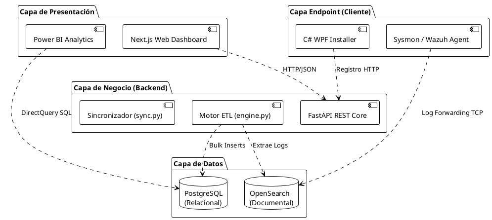
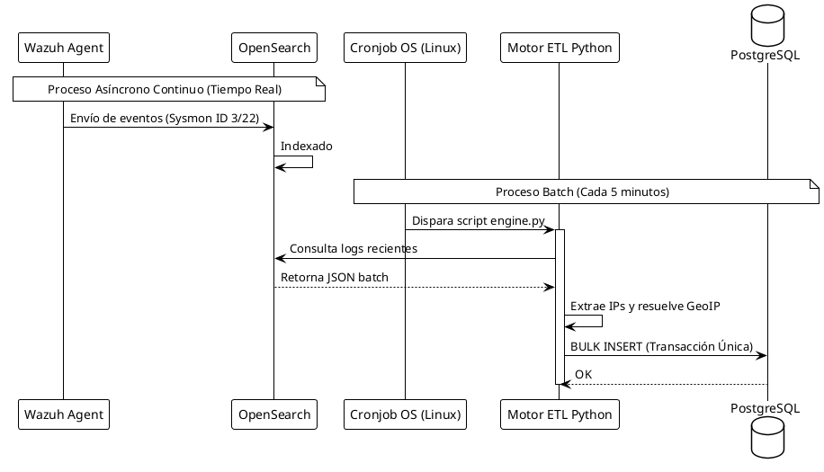
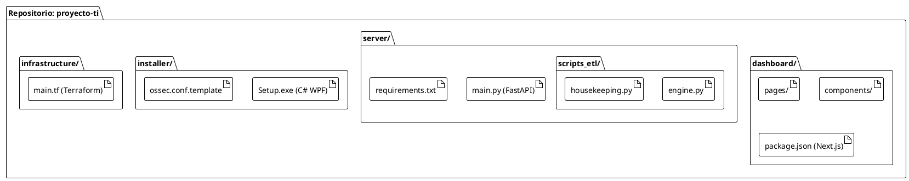
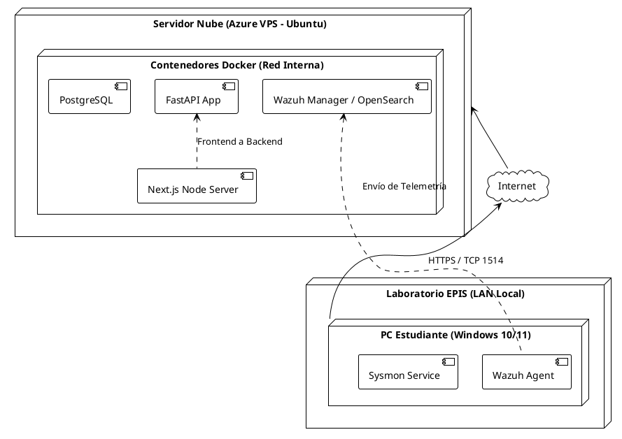
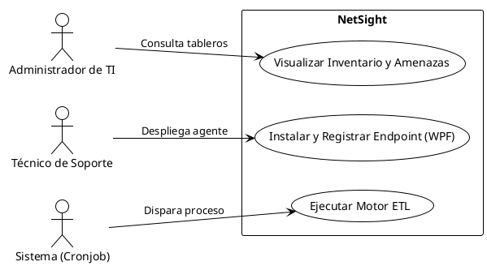
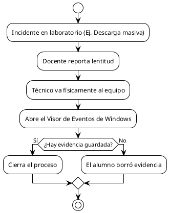
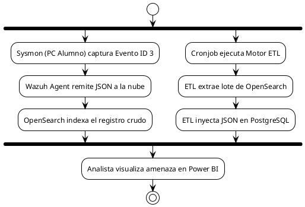
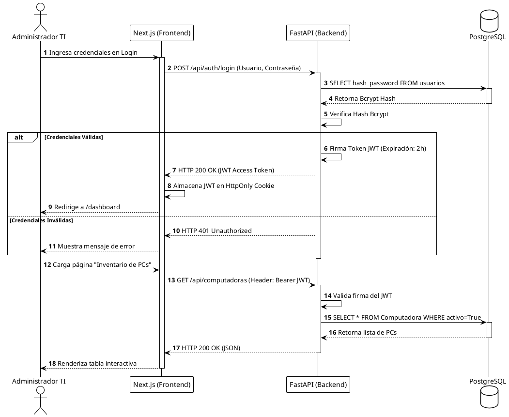
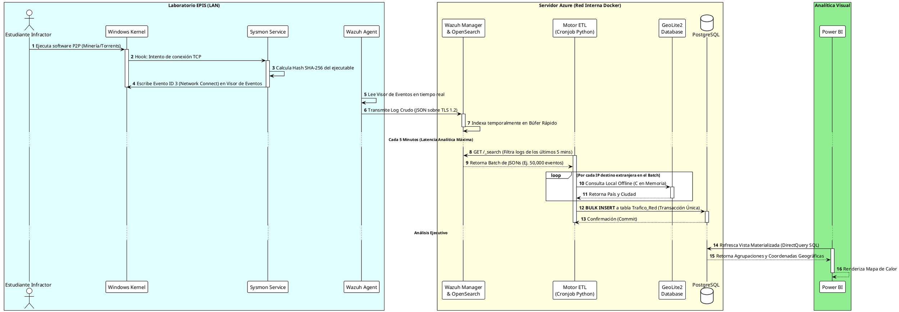
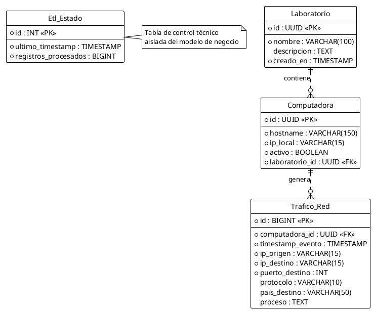

# FD04 - Informe de Arquitectura de Software (NetSight)

## 1. Introducción

### 1.1. Propósito
El propósito de este documento es proporcionar una apreciación global y exhaustiva de la arquitectura de software del **Sistema de Telemetría de Laboratorios (NetSight)**. Se utiliza el **Modelo de Vistas 4+1 de Kruchten** para ilustrar el sistema desde la perspectiva de sus múltiples partes interesadas (stakeholders), tales como desarrolladores, integradores, administradores de TI y analistas de ciberseguridad. Este documento sirve como guía principal para comprender la estructura subyacente y las decisiones de diseño del sistema.

### 1.2. Alcance
Este informe arquitectónico abarca todos los módulos que componen NetSight:
*   **Capa de Extracción (Endpoint):** Instalador C# WPF y agente Wazuh/Sysmon.
*   **Capa de Integración y Procesamiento:** Motor ETL asíncrono y API REST construida en Python (FastAPI).
*   **Capa de Persistencia:** Bases de datos PostgreSQL y OpenSearch.
*   **Capa de Presentación:** Dashboard interactivo en Next.js y tableros analíticos en Power BI.

### 1.3. Definición, siglas y abreviaturas
*   **ETL (Extract, Transform, Load):** Proceso de extracción, transformación y carga de los registros de telemetría de red.
*   **Wazuh:** Plataforma de código abierto empleada para la recolección, agregación y análisis de amenazas (SIEM).
*   **Sysmon:** System Monitor, servicio de Windows que registra de forma detallada la actividad del sistema (creación de procesos, conexiones de red).
*   **API REST:** Interfaz de Programación de Aplicaciones basada en el protocolo HTTP.
*   **DirectQuery:** Método de conexión de Power BI que permite consultar los datos de la base de datos subyacente en tiempo real sin importarlos a memoria.
*   **Cronjob:** Administrador de tareas en segundo plano del sistema operativo Linux, usado para orquestar el ETL.

### 1.4. Referencias
*   **[FD03]** NetSight: Especificación de Requerimientos y Casos de Uso.
*   Documentación Oficial de Arquitectura de Wazuh v4.x.
*   Kruchten, P. B. (1995). *The 4+1 View Model of Architecture*. IEEE Software.

### 1.5. Visión General
El resto de este documento detalla la **Representación Arquitectónica** del sistema mediante cinco vistas clave:
*   **Escenarios (Casos de Uso):** Describe el sistema desde la perspectiva de sus usuarios.
*   **Vista Lógica:** Enfocada en la estructura de clases y paquetes (perspectiva del analista/diseñador).
*   **Vista del Proceso:** Enfocada en el flujo de control, concurrencia y sincronización (perspectiva del integrador).
*   **Vista del Desarrollo:** Enfocada en la organización del código fuente e infraestructura de desarrollo (perspectiva del programador).
*   **Vista Física:** Enfocada en el despliegue del software en el hardware (perspectiva del ingeniero de sistemas/redes).

---

## 2. Representación Arquitectónica

La arquitectura de NetSight sigue un estilo basado en **Microservicios Híbridos y Tuberías de Datos (Pipeline/ETL)**, orquestando una arquitectura Cliente-Servidor donde el trabajo pesado se delega a procesamientos por lotes (*Batch Processing*) en la nube, optimizando el consumo de recursos de las terminales de laboratorio.

### 2.1. Escenarios
Los escenarios actúan como el "+1" en el modelo, uniendo y validando las otras cuatro vistas. Los escenarios críticos que moldean la arquitectura son:
1.  **Recolección Silenciosa de Telemetría (CU-02):** Requiere despliegue rápido y nula intervención del usuario, dictaminando la necesidad de un Instalador WPF aislado.
2.  **Sincronización Masiva y Analítica (CU-05):** Dictamina la necesidad de un motor ETL separado del Backend REST, ya que procesar miles de registros en tiempo real bloquearía el flujo de trabajo síncrono del Dashboard web.

### 2.2. Vista Lógica
La Vista Lógica muestra las abstracciones clave del sistema y cómo se agrupan funcionalmente. NetSight se divide en 4 grandes capas de responsabilidad:



### 2.3. Vista del Proceso
Esta vista aborda la concurrencia, distribución y sincronización. El sistema maneja dos flujos de proceso completamente asíncronos y paralelos:
1.  **Proceso de Usuario (Síncrono):** El Administrador realiza peticiones CRUD mediante la web y FastAPI responde instantáneamente leyendo de PostgreSQL.
2.  **Proceso de Telemetría (Asíncrono/Batch):** Independiente de los usuarios, los agentes envían datos continuamente. El motor ETL despierta periódicamente (Cronjob), consume de OpenSearch y procesa masivamente.



### 2.4. Vista del desarrollo
Muestra cómo se organiza estáticamente el código fuente y las dependencias de los módulos. El repositorio se estructura de manera modular:



### 2.5. Vista Física
Define cómo se mapean los componentes de software a la infraestructura de hardware y redes subyacente.




## 3. Objetivos y limitaciones arquitectónicas

### 3.1. Disponibilidad
El núcleo del sistema (los colectores de Wazuh/OpenSearch) debe mantener una disponibilidad de 24/7 (99.9% Uptime) para garantizar que ningún evento de telemetría de los laboratorios se pierda, incluso si el Dashboard web se encuentra en mantenimiento. Por limitación arquitectónica, si el servidor en Azure pierde conexión temporal con la LAN de la EPIS, el agente local de Wazuh encolará los registros en el disco duro local de la terminal y los transmitirá en ráfaga una vez restaurada la conectividad.

### 3.2. Seguridad
Toda la telemetría viaja cifrada a través de protocolos seguros (HTTPS/TLS) desde la EPIS hacia Azure. Una limitación arquitectónica autoimpuesta es que el motor de base de datos relacional (PostgreSQL) se despliega en una red privada virtual de Docker, sin exposición de su puerto (5432) al internet público. Los administradores solo pueden acceder a los datos indirectamente mediante el Dashboard (autenticado) o Power BI (mediante Gateway o credenciales cifradas).

### 3.3. Adaptabilidad
El sistema está diseñado para ser altamente agnóstico a la infraestructura subyacente. Al separar la Capa de Integración (FastAPI/Motor ETL) y la Capa de Datos (PostgreSQL/OpenSearch) en contenedores, la arquitectura puede migrar fácilmente desde Microsoft Azure hacia Amazon Web Services (AWS), Google Cloud, o incluso a servidores físicos locales (On-Premise) de la universidad sin necesidad de refactorizar el código fuente.

### 3.4. Rendimiento
La principal limitación de rendimiento a sortear fue la potencial saturación del ancho de banda de la universidad y el colapso de la base de datos por alta concurrencia. Arquitectónicamente, esto se resolvió aplicando un **Filtro de Ruido en el Origen** (Sysmon solo captura los Event IDs 3 y 22) y delegando la escritura en la base de datos a un **Proceso por Lotes Asíncrono (Motor ETL)**. Esto garantiza que la base de datos responda en milisegundos a las consultas del Dashboard sin verse ralentizada por la inserción masiva.

---

## 4. Análisis de Requerimientos

La arquitectura fue moldeada directamente para dar soporte a los requerimientos especificados en el documento FD03.

### 4.1. Requerimientos funcionales
La correspondencia entre funcionalidad y arquitectura se maneja de la siguiente manera:
*   **Gestión de Inventario (RFF-01, RFF-03):** Se satisface mediante la Capa de Presentación (Next.js) consumiendo la API REST, la cual abstrae las consultas SQL, asegurando una separación entre la interfaz de usuario y la persistencia de datos.
*   **Procesamiento y Enriquecimiento (RFF-04):** Para cumplir con la necesidad de saber a qué país se conectan los alumnos, el Motor ETL en Python fue diseñado para interceptar el log crudo, conectarse en milisegundos a una base de datos local GeoLite2 y enriquecer el JSON antes de enviarlo a PostgreSQL.
*   **Análisis Visual en Tiempo Real (RFF-08):** Para habilitar los mapas de calor dinámicos, se arquitectó el uso del protocolo *DirectQuery* en Power BI, forzando a la base de datos a utilizar **Vistas Materializadas** (_trafico_resumen) para evitar recalcular sumatorias de miles de filas repetidamente.

### 4.2. Requerimientos no funcionales
Las restricciones técnicas dictaminaron las siguientes decisiones de diseño:
*   **Despliegue Sin Fricción (RNF-05):** Para cumplir con este requerimiento, se diseñó la aplicación cliente como un binario autónomo (.exe) desarrollado en C# WPF, empaquetando internamente los instaladores .msi y configuraciones .xml, evitando que el Técnico de Soporte deba lidiar con múltiples archivos por separado.
*   **Límites de Almacenamiento (RN-02):** La exigencia de no llenar el disco del servidor dio origen al script autónomo housekeeping.py. Arquitectónicamente, se decidió aislarlo del flujo principal (Backend) y orquestarlo directamente desde el sistema operativo anfitrión (Cronjob) para asegurar su ejecución ininterrumpida incluso si el servicio web falla.


## 5. Vistas de Caso de Uso

La vista de Casos de Uso expone la funcionalidad del sistema desde el punto de vista de los actores externos (humanos y otros sistemas). 



---

## 6. Vista Lógica

La vista lógica define las piezas clave del software y cómo se comunican a alto nivel, abstraídas de la tecnología subyacente. Se utiliza el estándar **C4 Model**.

### 6.1. Diagrama Contextual (Nivel 1)
Muestra a NetSight en el centro, interactuando con los usuarios y sistemas externos.

```plantuml
@startuml
!theme plain
!include https://raw.githubusercontent.com/plantuml-stdlib/C4-PlantUML/master/C4_Context.puml

Person(admin, "Administrador TI / Seguridad", "Monitorea laboratorios y analiza amenazas de red.")
Person(tech, "Técnico de Soporte", "Instala y configura las terminales físicas en la EPIS.")

System(netsight, "NetSight", "Sistema de Telemetría de Laboratorios. Recolecta, procesa y visualiza tráfico de red.")
System_Ext(windows, "Windows OS / Sysmon", "Sistema operativo fuente que genera los eventos de red crudos.")
System_Ext(geoip, "GeoLite2 Database", "Base de datos externa offline para resolución de geolocalización.")

Rel(admin, netsight, "Visualiza dashboards y gestiona laboratorios")
Rel(tech, netsight, "Registra nuevas terminales")
Rel(netsight, windows, "Captura logs del sistema")
Rel(netsight, geoip, "Consulta país de origen por IP")
@enduml
```

#### 6.1.1. Justificación de Interacciones a Nivel de Contexto
*   **Aislamiento del Origen:** La decisión de usar el agente Sysmon y Wazuh instalados directamente en el kernel de Windows asegura que la telemetría no pueda ser alterada por software malicioso en espacio de usuario.
*   **Geolocalización Offline (GeoLite2):** Se optó por una base de datos de geolocalización local (offline) integrada en el servidor, en lugar de consumir una API externa. Esto elimina el riesgo de latencia de red (*Network I/O*) y evita bloqueos por límites de peticiones (*Rate Limiting*) cuando miles de eventos se procesan por segundo.

---

## 7. Vista de Procesos

Describe el flujo temporal y dinámico de la información en el sistema, detallando el antes y el después de la implementación.

### 7.1. Diagrama de Proceso Actual
Sin la arquitectura propuesta, el rastreo de eventos es lineal, manual y dependiente de un reporte humano.



### 7.2. Diagrama de Proceso Propuesto
Con NetSight, el proceso es asíncrono y en tiempo real, garantizando la inmutabilidad de la evidencia.



---


### 7.3. Diagrama de Secuencia: Flujo de Autenticación y Gestión (Síncrono)
Este diagrama detalla la interacción a nivel de red y base de datos cuando un Administrador TI accede al Dashboard para gestionar las computadoras. Se evidencia el uso de JWT para el control de sesiones sin estado (Stateless).



### 7.4. Diagrama de Secuencia: Ciclo de Vida de la Telemetría Forense (Asíncrono)
Este diagrama ilustra el viaje profundo de un *Log* desde que el alumno intenta vulnerar la red, hasta que la alerta aparece en el lienzo de Power BI. Demuestra el aislamiento del proceso ETL (*Batching*).



## 8. Vista de Despliegue

La vista de despliegue ilustra cómo y dónde se alojan los contenedores lógicos en los servidores físicos o virtuales.

### 8.1. Diagrama de Contenedor (Nivel 2)
Detalla los contenedores Docker que se ejecutan dentro de la máquina virtual (Azure) y los ejecutables en la terminal.

```plantuml
@startuml
!theme plain
!include https://raw.githubusercontent.com/plantuml-stdlib/C4-PlantUML/master/C4_Container.puml

Person(admin, "Analista de Seguridad")

System_Boundary(c1, "NetSight (Azure Cloud)") {
    Container(web, "Next.js Dashboard", "Node.js", "Provee interfaz web para gestión de inventario")
    Container(api, "FastAPI Backend", "Python", "API REST para recepción de agentes y orquestación")
    ContainerDb(db, "PostgreSQL", "Relacional", "Almacena tráfico estructurado y laboratorios")
    ContainerDb(os, "OpenSearch", "Documental", "Motor de indexación de Wazuh Manager")
    Container(etl, "Motor ETL", "Python script", "Extrae de OpenSearch, limpia y guarda en PostgreSQL")
}

System_Boundary(c2, "Laboratorio EPIS") {
    Container(agent, "Wazuh Agent + Sysmon", "C / XML", "Colector de eventos del kernel de Windows")
    Container(pbi, "Power BI Desktop", "DAX/M", "Tableros de analítica conectada vía DirectQuery")
}

Rel(agent, os, "Envía telemetría", "TCP 1514 / TLS")
Rel(etl, os, "Consume batch", "REST API")
Rel(etl, db, "Bulk Insert", "psycopg2")
Rel(web, api, "Llamadas CRUD", "HTTPS/JSON")
Rel(api, db, "Lectura/Escritura", "SQLAlchemy")
Rel(admin, pbi, "Explora mapas de calor")
Rel(pbi, db, "DirectQuery SQL", "ODBC")
@enduml
```

#### 8.1.1. Decisiones Tecnológicas de Contenedores
*   **Next.js (Frontend):** Elegido por su capacidad de *Server-Side Rendering (SSR)*, lo que permite entregar el Dashboard a los administradores con un tiempo de carga inicial mínimo y proteger las variables de entorno de la base de datos en el servidor.
*   **FastAPI (Backend API):** Framework de Python seleccionado por su soporte nativo de asincronía (`asyncio`), vital para mantener el servidor web responsivo mientras orquesta tareas en segundo plano.
*   **OpenSearch vs PostgreSQL:** OpenSearch se utiliza como un *buffer* masivo rápido (NoSQL) para absorber los picos de telemetría sin estructurar. PostgreSQL (Relacional) se usa posteriormente para la consolidación analítica, garantizando el cumplimiento ACID para el inventario de laboratorios.

### 8.2. Especificaciones de Infraestructura y Redes (Azure)
Para soportar la carga de múltiples contenedores de grado empresarial, la infraestructura desplegada mediante **Terraform** provisiona los siguientes recursos exactos:
*   **Servidor Virtual (Azure VPS):** Instancia `Standard_D4s_v3` (4 vCPUs, 16 GiB RAM). La alta memoria RAM es un requisito estricto del motor Java subyacente de OpenSearch.
*   **Almacenamiento:** Disco SSD Premium de 256 GB, necesario para soportar las altas tasas de IOPS (Input/Output Operations Per Second) generadas por la escritura concurrente de logs.
*   **Topología de Red (NSG):** 
    *   `TCP 1514 (Wazuh Auth/Events)`: Abierto al exterior para recibir la telemetría cifrada.
    *   `TCP 443 (HTTPS)`: Abierto para la interfaz del Dashboard web.
    *   `TCP 5432 (PostgreSQL)` y `TCP 9200 (OpenSearch)`: Bloqueados absolutamente desde el exterior. Solo accesibles a través de la red virtual interna (VNet) de Docker.

---

## 9. Vista de Implementación

Muestra la disposición del código fuente y los componentes internos que conforman cada contenedor.

### 9.1. Diagrama de Componentes (Nivel 3)
Enfocado en el interior del Contenedor Backend (FastAPI + ETL), mostrando cómo interactúan sus módulos internos de software.

```plantuml
@startuml
!theme plain
!include https://raw.githubusercontent.com/plantuml-stdlib/C4-PlantUML/master/C4_Component.puml

Container_Boundary(api, "Backend Application (FastAPI & Python)") {
    Component(router, "Router API", "FastAPI APIRouter", "Expone endpoints REST (/api/computadoras, /api/laboratorios)")
    Component(controller, "Controladores CRUD", "Python", "Lógica de negocio para registro de máquinas")
    Component(orm, "Capa ORM", "SQLAlchemy", "Mapeo objeto-relacional para interactuar con BD")
    Component(engine, "Script ETL", "engine.py", "Gestor asíncrono de transformación de datos")
    Component(geoip, "Módulo GeoIP", "geo_utils.py", "Resuelve direcciones IP a Países/Ciudades")
}

ContainerDb(db, "PostgreSQL", "Relacional", "")

Rel(router, controller, "Rutea petición")
Rel(controller, orm, "Llama métodos BD")
Rel(orm, db, "Ejecuta queries")
Rel(engine, geoip, "Enriquece IP destino")
Rel(engine, orm, "Invoca Bulk Insert")
@enduml
```

#### 9.1.1. Especificación Interna de Componentes del Backend
*   **Pydantic (Modelos de Validación):** Todo dato que ingresa a los APIRouters es estrictamente tipado y sanitizado mediante esquemas Pydantic, rechazando peticiones malformadas automáticamente (HTTP 422).
*   **SQLAlchemy (ORM):** Abstrae las consultas SQL crudas. Protege estructuralmente contra ataques de Inyección SQL (SQLi) mediante el uso automático de consultas parametrizadas.
*   **Procesamiento por Lotes (Bulk Insert):** El script `engine.py` utiliza el método `executemany()` de la librería `psycopg2`. En lugar de hacer 1,000 conexiones a la base de datos para 1,000 logs, agrupa los eventos y los inserta en una única transacción de red, maximizando el *Throughput* (Rendimiento).


### 9.2. Patrones de Diseño de Software Aplicados
Para garantizar que el código fuente sea mantenible, escalable y tolerante a cambios futuros, los componentes internos descritos anteriormente implementan rigurosamente los siguientes patrones de diseño de la industria:

1.  **Patrón Repository (Repositorio):**
    *   **Ubicación:** Backend (FastAPI).
    *   **Justificación:** Aísla la lógica de acceso a datos (SQLAlchemy) de la lógica de presentación (APIRouters). Si en un futuro la EPIS decide migrar de PostgreSQL a MySQL, los controladores web no requerirán modificaciones, ya que solo interactúan llamando a métodos abstractos como `get_computadoras()`, siendo el Repositorio el único encargado del SQL específico.

2.  **Patrón Singleton (Instancia Única):**
    *   **Ubicación:** Capa de Conexión a Base de Datos (FastAPI y Motor ETL).
    *   **Justificación:** Se utiliza para inicializar el *Connection Pool* de `psycopg2` y el *Engine* de `SQLAlchemy`. Garantiza que, sin importar cuántas peticiones simultáneas reciba el backend, solo exista una única instancia global administrando los *sockets* hacia la base de datos, previniendo el fatídico colapso por "Exceso de conexiones" (*Too many connections*).

3.  **Patrón Productor-Consumidor (Producer-Consumer):**
    *   **Ubicación:** Arquitectura de Telemetría (OpenSearch -> Motor ETL).
    *   **Justificación:** Desacopla radicalmente la ingesta masiva de la persistencia relacional. Los miles de agentes Wazuh actúan como *Productores* frenéticos inyectando logs en el búfer de alta velocidad de OpenSearch. El script Python `engine.py` actúa como el *Consumidor*, extrayendo lotes (Batches) a su propio ritmo. Este patrón salva a PostgreSQL de ser atacado por micro-inserciones concurrentes que bloquearían sus tablas.

4.  **Patrón Modelo-Vista-Controlador (MVC) enfocado en Componentes:**
    *   **Ubicación:** Frontend Web (Next.js).
    *   **Justificación:** La interfaz web divide responsabilidades. Los componentes de React (`.tsx`) fungen puramente como la **Vista** reactiva. Las funciones de obtención de datos del lado del servidor (*Server-Side Props / Server Components*) actúan como el **Controlador**, inyectando el **Modelo** (datos JSON tipados vía TypeScript) directamente en los componentes antes de despacharlos al navegador del administrador, garantizando un renderizado seguro y ultra-rápido.

## 10. Vista de Datos

Esta vista se enfoca en la estructura relacional subyacente que asegura la persistencia, integridad y escalabilidad de los datos recolectados.

### 10.1. Diagrama Entidad Relación
El modelo de datos está optimizado tanto para escrituras masivas como para consultas analíticas (OLAP).



### 10.2. Diccionario de Datos Exhaustivo

A continuación, se detalla la estructura física de las tablas desplegadas en **PostgreSQL 15**, definiendo los tipos de datos exactos, restricciones (Constraints) y relaciones foráneas.

#### Tabla: `Laboratorio`
Almacena el inventario físico de las aulas o laboratorios de la EPIS.
| Campo | Tipo de Dato (PostgreSQL) | Restricción (Constraint) | Descripción |
| :--- | :--- | :--- | :--- |
| `id` | `UUID` | `PRIMARY KEY` | Identificador único universal generado automáticamente. |
| `nombre` | `VARCHAR(100)` | `NOT NULL, UNIQUE` | Nombre o código del laboratorio (Ej. "LAB-01"). |
| `descripcion` | `TEXT` | `NULL` | Descripción técnica o académica del laboratorio. |
| `creado_en` | `TIMESTAMP` | `NOT NULL, DEFAULT NOW()` | Fecha exacta de la creación del registro. |

#### Tabla: `Computadora`
Representa cada *Endpoint* físico donde el agente de telemetría está instalado.
| Campo | Tipo de Dato (PostgreSQL) | Restricción (Constraint) | Descripción |
| :--- | :--- | :--- | :--- |
| `id` | `UUID` | `PRIMARY KEY` | Identificador inmutable de la máquina. |
| `hostname` | `VARCHAR(150)` | `NOT NULL` | Nombre NetBIOS o DNS del equipo (Ej. "LAB01-PC05"). |
| `ip_local` | `INET` | `NOT NULL` | Dirección IP IPv4/IPv6 asignada en la LAN. |
| `activo` | `BOOLEAN` | `NOT NULL, DEFAULT TRUE` | Estado lógico. `FALSE` si la máquina fue dada de baja. |
| `laboratorio_id` | `UUID` | `FOREIGN KEY` | Relación con la tabla `Laboratorio` (ON DELETE CASCADE). |

#### Tabla: `Trafico_Red` (Tabla Transaccional / Hechos)
Tabla principal de alta frecuencia (*High-Volume Table*). Almacena cada conexión interceptada por Sysmon. Optimizada para indexación particionada.
| Campo | Tipo de Dato (PostgreSQL) | Restricción (Constraint) | Descripción |
| :--- | :--- | :--- | :--- |
| `id` | `BIGSERIAL` | `PRIMARY KEY` | Autoincremental de 64-bits para soportar billones de filas. |
| `computadora_id` | `UUID` | `FOREIGN KEY` | Vínculo directo a la PC de origen en el laboratorio. |
| `timestamp_evento` | `TIMESTAMPTZ` | `NOT NULL` | Fecha/Hora del kernel (con zona horaria) en que ocurrió la conexión. |
| `ip_origen` | `INET` | `NOT NULL` | IP interna de la PC (verificable contra `Computadora.ip_local`). |
| `ip_destino` | `INET` | `NOT NULL` | IP pública/externa hacia donde se dirigía el tráfico. |
| `puerto_destino` | `INTEGER` | `NOT NULL` | Puerto lógico lógico de salida (Ej. 443, 80, 53). Indexado. |
| `protocolo` | `VARCHAR(10)` | `NOT NULL` | Protocolo de transporte (TCP, UDP). |
| `pais_destino` | `VARCHAR(50)` | `NULL` | País resuelto por el motor ETL (GeoIP). Clave para Power BI. |
| `proceso` | `JSONB` | `NULL` | Estructura JSON indexable con metadata del binario (Path y SHA-256). |

#### Tabla: `Etl_Estado`
Tabla técnica (Metadata) para orquestar los *Batch Inserts* asíncronos y evitar procesar eventos repetidos.
| Campo | Tipo de Dato (PostgreSQL) | Restricción (Constraint) | Descripción |
| :--- | :--- | :--- | :--- |
| `id` | `SERIAL` | `PRIMARY KEY` | Llave subrogada clásica. |
| `ultimo_timestamp`| `TIMESTAMPTZ` | `NOT NULL` | Marca de tiempo del último log procesado desde OpenSearch. |
| `registros_procesados`| `BIGINT` | `NOT NULL` | Cantidad total de logs migrados en el último ciclo Cronjob. |


---

## 11. Calidad

Los escenarios de calidad describen cómo responde la arquitectura de NetSight frente a estímulos críticos del entorno, validando los requerimientos no funcionales.

### 11.1. Escenario de Seguridad
*   **Estímulo:** Un atacante externo intenta conectarse directamente al puerto de la base de datos PostgreSQL usando un ataque de fuerza bruta.
*   **Respuesta del Sistema:** El *Network Security Group (NSG)* de Azure y el aislamiento interno de la red de contenedores Docker rechazan el tráfico entrante en el puerto 5432, logueando el intento fallido. Solo se permite tráfico por el puerto 443 (HTTPS) hacia la API.
*   **Métrica:** 100% de los intentos directos de acceso externo son denegados silenciosamente en el nivel de Capa 4 (Transporte). La superficie de ataque se reduce drásticamente.

### 11.2. Escenario de Usabilidad
*   **Estímulo:** El Analista de Seguridad consulta el "Mapa de Calor Global" en Power BI abarcando los últimos 7 días de actividad de los laboratorios (millones de filas de tráfico).
*   **Respuesta del Sistema:** Debido a que el Motor ETL pre-consolida métricas geográficas en la tabla principal y usa tipos de datos indexados nativamente en PostgreSQL, *DirectQuery* recupera los agregados casi instantáneamente sin sobrecargar la memoria del cliente.
*   **Métrica:** Los tableros visuales se renderizan en menos de 3 segundos bajo cargas analíticas pesadas (> 5 millones de registros). La latencia de interacción visual no supera los 500ms al aplicar filtros.

### 11.3. Escenario de Adaptabilidad
*   **Estímulo:** La dirección de la UPT decide migrar toda su infraestructura en la nube desde Microsoft Azure hacia Amazon Web Services (AWS) debido a una reducción de costos.
*   **Respuesta del Sistema:** Dado que todo el backend y la base de datos (FastAPI, OpenSearch, PostgreSQL) están empaquetados mediante *Docker Containers* y desplegados a través de *Terraform*, la arquitectura permanece agnóstica al sistema operativo anfitrión. Solo se cambian las credenciales de la nube y se ejecuta el despliegue automático.
*   **Métrica:** Migración arquitectónica completa y puesta en marcha en el nuevo proveedor de nube en un tiempo menor a 4 horas (RTO esperado) sin cambios en el código fuente. Pérdida de datos cercana a cero (RPO < 5 minutos) si existen backups periódicos de volúmenes Docker.

### 11.4. Escenario de Disponibilidad
*   **Estímulo:** Ocurre un corte masivo de internet en el campus de la universidad (EPIS) cortando la comunicación entre las terminales físicas y el servidor NetSight en Azure.
*   **Respuesta del Sistema:** El agente local Wazuh detecta la pérdida de comunicación TCP e ingresa a modo de caché local (*buffer*). Continúa capturando y guardando todos los eventos de Sysmon localmente sin impactar el rendimiento de la clase del estudiante.
*   **Métrica:** El agente cliente soporta colas anti-caída (Anti-flooding) de hasta 1GB local. Una vez restablecido el enlace, el 100% de los logs cacheados se transmiten progresivamente al servidor sin saturar el ancho de banda, logrando cero pérdida de telemetría.

### 11.5. Otro Escenario: Escenario de Trazabilidad y Auditoría
*   **Estímulo:** Un estudiante malintencionado en un laboratorio de redes intenta ocultar su rastro utilizando un navegador en modo incógnito, herramientas portables o borrando el caché, tras realizar un intento de denegación de servicio (DoS).
*   **Respuesta del Sistema:** El driver nativo de *Sysmon* opera a nivel del Kernel del sistema operativo (Ring 0). Intercepta la comunicación de red en el momento exacto en que se realiza la llamada al socket. El agente inyecta un *timestamp* absoluto y el hash (SHA256) del proceso ejecutable original, ignorando cualquier intento superficial de enmascaramiento.
*   **Métrica:** Se garantiza la cadena de custodia técnica. El Analista de Seguridad recibe trazabilidad 100% inmutable basada en hashes SHA-256 de los binarios. El evento registrado sirve como evidencia digital forense irrefutable para la aplicación de normativas institucionales.
