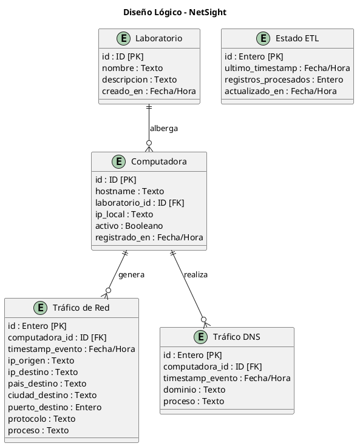
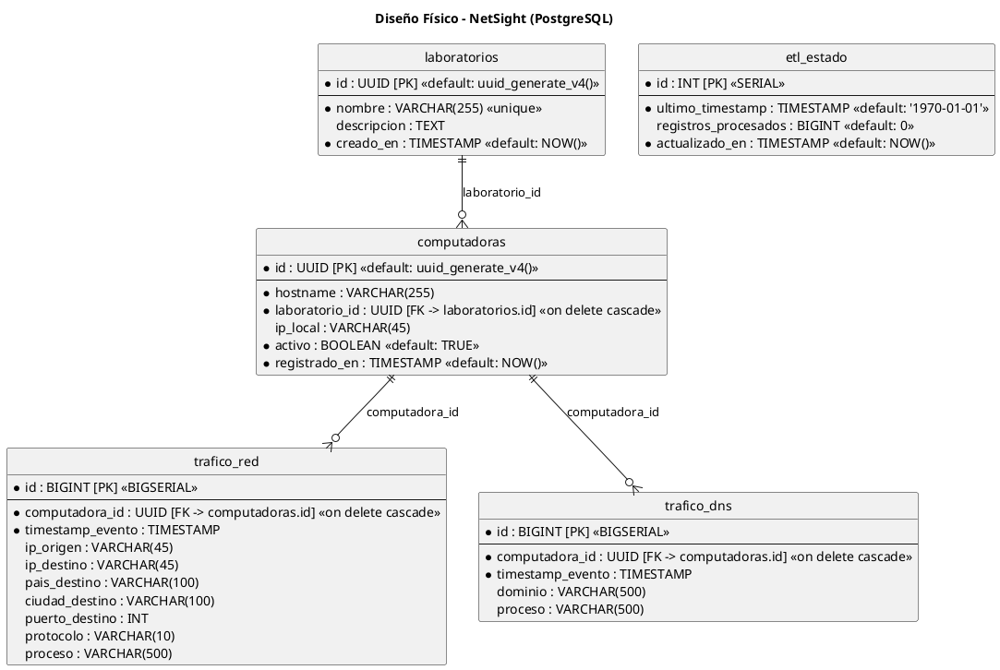

# 📚 Diccionario de Datos del Proyecto - NetSight

Este documento proporciona la especificación técnica completa y detallada del modelo de datos implementado en PostgreSQL para el sistema **NetSight**. Muestra la estructura de almacenamiento físico y lógico, las relaciones entre entidades, las vistas de explotación analítica y el script completo de definición de base de datos (DDL).

---

## 1. Modelo Entidad / Relación

### 1.1. Diseño Lógico
El diseño lógico define las entidades de negocio, sus atributos esenciales y las relaciones que gobiernan las reglas del sistema de telemetría sin depender de detalles específicos de un motor de bases de datos.

A continuación se presenta el código para el editor de [PlantUML](https://plantuml.com/):



### 1.2. Diseño Físico
El diseño físico traduce el modelo lógico a la especificación técnica final de PostgreSQL, detallando las claves primarias (PK), foráneas (FK), tipos de datos físicos (UUID, BIGSERIAL, VARCHAR, etc.), restricciones (CONSTRAINTS), índices de rendimiento y comportamientos en cascada.

A continuación se presenta el código para el editor de [PlantUML](https://plantuml.com/):



---

## 2. DICCIONARIO DE DATOS

### 2.1. Tablas

#### 2.1.1. Tabla: `laboratorios`
Registra los laboratorios físicos de cómputo que forman parte de la red académica monitoreada.

| Nombre de Columna | Tipo de Datos | Llave | Nulo | Valor por Defecto | Descripción |
| :--- | :--- | :---: | :---: | :--- | :--- |
| **id** | UUID | PK | No | `uuid_generate_v4()` | Identificador único universal para cada laboratorio. |
| **nombre** | VARCHAR(255) | - | No | - | Nombre único asignado al laboratorio (ej. 'LAB-101'). Posee índice UNIQUE. |
| **descripcion** | TEXT | - | Sí | - | Descripción opcional detallando ubicación, aforo, o recursos del laboratorio. |
| **creado_en** | TIMESTAMP | - | No | `NOW()` | Fecha y hora en la que se registró el laboratorio en la plataforma. |

* **Índices y Restricciones:**
  * `laboratorios_pkey`: Clave primaria sobre el campo `id`.
  * `laboratorios_nombre_key`: Restricción UNIQUE en la columna `nombre`.

---

#### 2.1.2. Tabla: `computadoras`
Registra las terminales (computadoras) instaladas dentro de cada laboratorio que transmiten telemetría mediante Sysmon/Wazuh.

| Nombre de Columna | Tipo de Datos | Llave | Nulo | Valor por Defecto | Descripción |
| :--- | :--- | :---: | :---: | :--- | :--- |
| **id** | UUID | PK | No | `uuid_generate_v4()` | Identificador único universal para cada computadora. |
| **hostname** | VARCHAR(255) | - | No | - | Nombre de red de la máquina (Environment.MachineName). |
| **laboratorio_id** | UUID | FK | No | - | Referencia al laboratorio al cual pertenece físicamente la PC. |
| **ip_local** | VARCHAR(45) | - | Sí | - | Última dirección IP local registrada para la PC (admite IPv4 e IPv6). |
| **activo** | BOOLEAN | - | No | `TRUE` | Bandera de estado que indica si la terminal está en línea o reportando logs. |
| **registrado_en** | TIMESTAMP | - | No | `NOW()` | Fecha y hora del registro inicial de la computadora. |

* **Índices y Restricciones:**
  * `computadoras_pkey`: Clave primaria sobre el campo `id`.
  * `computadoras_laboratorio_id_fkey`: Clave foránea que referencia a `laboratorios(id)` con comportamiento `ON DELETE CASCADE`.
  * `idx_computadoras_laboratorio_id`: Índice B-Tree no único sobre `laboratorio_id` para acelerar filtrados de PCs por laboratorio.

---

#### 2.1.3. Tabla: `trafico_red`
Contiene la telemetría histórica detallada de conexiones de red TCP, UDP e ICMP salientes capturadas por Sysmon (Event ID 3).

| Nombre de Columna | Tipo de Datos | Llave | Nulo | Valor por Defecto | Descripción |
| :--- | :--- | :---: | :---: | :--- | :--- |
| **id** | BIGINT | PK | No | *Nextval (BIGSERIAL)* | Identificador secuencial autonumérico de gran escala (64-bit). |
| **computadora_id** | UUID | FK | No | - | Identificador de la computadora que generó el evento de red. |
| **timestamp_evento** | TIMESTAMP | - | No | - | Marca de tiempo exacta generada por el Kernel de Windows para el evento. |
| **ip_origen** | VARCHAR(45) | - | Sí | - | Dirección IP local origen de la PC que inició la conexión. |
| **ip_destino** | VARCHAR(45) | - | Sí | - | Dirección IP destino de la conexión externa o interna. |
| **pais_destino** | VARCHAR(100) | - | Sí | - | País de la IP destino resuelto por el motor ETL usando MaxMind GeoIP. |
| **ciudad_destino** | VARCHAR(100) | - | Sí | - | Ciudad de la IP destino resuelta por el motor ETL usando MaxMind GeoIP. |
| **puerto_destino** | INT | - | Sí | - | Puerto de red de destino (ej. 80, 443, 3389, etc.). |
| **protocolo** | VARCHAR(10) | - | Sí | - | Protocolo de comunicación (ej. 'TCP', 'UDP'). |
| **proceso** | VARCHAR(500) | - | Sí | - | Nombre base del archivo ejecutable que inició la conexión (ej. 'chrome.exe'). |

* **Índices y Restricciones:**
  * `trafico_red_pkey`: Clave primaria sobre el campo `id`.
  * `trafico_red_computadora_id_fkey`: Clave foránea que apunta a `computadoras(id)` con comportamiento `ON DELETE CASCADE`.
  * `idx_trafico_red_timestamp`: Índice B-Tree en `timestamp_evento` para optimizar consultas de series temporales y housekeeper.
  * `idx_trafico_red_computadora`: Índice B-Tree en `computadora_id` para acelerar resúmenes por terminales.

---

#### 2.1.4. Tabla: `trafico_dns`
Almacena el registro histórico de las consultas DNS realizadas por las computadoras clientes, capturadas por Sysmon (Event ID 22).

| Nombre de Columna | Tipo de Datos | Llave | Nulo | Valor por Defecto | Descripción |
| :--- | :--- | :---: | :---: | :--- | :--- |
| **id** | BIGINT | PK | No | *Nextval (BIGSERIAL)* | Identificador secuencial autonumérico de gran escala (64-bit). |
| **computadora_id** | UUID | FK | No | - | Identificador de la computadora que solicitó la resolución de dominio. |
| **timestamp_evento** | TIMESTAMP | - | No | - | Marca de tiempo exacta generada en el cliente Windows. |
| **dominio** | VARCHAR(500) | - | Sí | - | El nombre de dominio consultado por la terminal (ej. 'github.com'). |
| **proceso** | VARCHAR(500) | - | Sí | - | Ejecutable local que disparó la consulta DNS (ej. 'spotify.exe'). |

* **Índices y Restricciones:**
  * `trafico_dns_pkey`: Clave primaria sobre el campo `id`.
  * `trafico_dns_computadora_id_fkey`: Clave foránea referenciando a `computadoras(id)` con comportamiento `ON DELETE CASCADE`.
  * `idx_trafico_dns_timestamp`: Índice B-Tree en `timestamp_evento` para acelerar reportes históricos y purgas.
  * `idx_trafico_dns_computadora`: Índice B-Tree en `computadora_id` para acelerar agrupaciones por máquina.

---

#### 2.1.5. Tabla: `etl_estado`
Tabla de control interno de una sola fila para el motor ETL de Python. Administra la carga incremental de logs evitando procesamientos duplicados.

| Nombre de Columna | Tipo de Datos | Llave | Nulo | Valor por Defecto | Descripción |
| :--- | :--- | :---: | :---: | :--- | :--- |
| **id** | INT | PK | No | *Nextval (SERIAL)* | Identificador de fila secuencial autonumérico. |
| **ultimo_timestamp** | TIMESTAMP | - | No | `'1970-01-01 00:00:00'` | Marca de tiempo del último log extraído con éxito de OpenSearch. |
| **registros_procesados** | BIGINT | - | Sí | `0` | Contador histórico acumulado de eventos procesados y guardados. |
| **actualizado_en** | TIMESTAMP | - | No | `NOW()` | Última vez que se modificó este registro de estado de ejecución. |

* **Índices y Restricciones:**
  * `etl_estado_pkey`: Clave primaria sobre el campo `id`.

---

### 2.2. PROCEDIMIENTOS ALMACENADOS / FUNCIONES DEL SISTEMA
El diseño actual de base de datos de NetSight aprovecha las capacidades nativas de PostgreSQL mediante el uso de extensiones de sistema y funciones del motor.

| Nombre de Función | Esquema | Tipo de Retorno | Parámetros de Entrada | Descripción / Propósito |
| :--- | :--- | :--- | :--- | :--- |
| **`uuid_generate_v4()`** | `public` (extensión `uuid-ossp`) | UUID | Ninguno | Genera un identificador universal único (UUID) aleatorio versión 4. Utilizado como valor por defecto en los campos ID de `laboratorios` y `computadoras`. |
| **`now()`** | `pg_catalog` (Sistema) | TIMESTAMP WITH TIME ZONE | Ninguno | Obtiene la marca de tiempo (timestamp) del sistema correspondiente a la fecha y hora de la transacción actual. |

---

### 2.3. PROCESOS DE NEGOCIO Y MANTENIMIENTO (APLICATIVOS)
En NetSight, los procesos de transformación de datos de gran escala, sincronización externa y mantenimiento de la base de datos se implementan a nivel del backend aplicativo en Python. Actúan de forma homóloga a los stored procedures tradicionales y son invocados de manera calendarizada o a través de Webhooks/API REST.

| Nombre de la Rutina | Endpoint API Relacionado | Frecuencia Sugerida | Parámetros | Descripción / Lógica de Base de Datos |
| :--- | :--- | :--- | :--- | :--- |
| **`run_etl()`** <br>*(engine.py)* | `POST /api/etl/sync` | Cada 5 minutos (Cron) | Ninguno | **Motor ETL de Conexiones:**<br>1. Lee el cursor temporal `ultimo_timestamp` en `etl_estado`. <br>2. Consulta y extrae en lote eventos Sysmon ID 3 y 22 desde OpenSearch.<br>3. Filtra hostnames contra la tabla `computadoras`. <br>4. Geolocaliza IPs usando la base binaria de MaxMind.<br>5. Inserta masivamente los registros usando `execute_values` de psycopg2 en las tablas `trafico_red` y `trafico_dns`. <br>6. Actualiza el valor del cursor temporal en `etl_estado`. |
| **`run_agent_sync()`** <br>*(sync_agents.py)* | `POST /api/etl/sync-agents` | Cada 1 hora (Cron) | Ninguno | **Sincronizador de Estado de Agentes:**<br>1. Realiza una petición REST al Wazuh Manager para obtener el estado de conexión de todos los agentes.<br>2. Cruza los hostnames con la tabla `computadoras`.<br>3. Ejecuta sentencias SQL `UPDATE` para alternar la bandera `activo` (`TRUE` o `FALSE`) según corresponda. |
| **`run_housekeeping()`** <br>*(housekeeping.py)* | `POST /api/etl/housekeeping` | Diario (Cron - Noche) | Días de Retención *(default: 30)* | **Mantenimiento y Purga de Historial:**<br>1. Calcula la fecha de corte restando los días de retención permitidos a la fecha actual (`NOW()`).<br>2. Ejecuta un comando `DELETE` por lotes sobre las tablas `trafico_red` y `trafico_dns` donde `timestamp_evento` sea menor que la fecha de corte. |

---

### 2.4. Vistas

#### 2.4.1. Vista: `v_trafico_resumen`
Vista consolidada desnormalizada diseñada para optimizar los tiempos de carga en Power BI (DirectQuery) y el panel Next.js, reduciendo los joins de tablas en tiempo real.

| Nombre del Campo | Origen de la Tabla | Campo Origen | Tipo de Datos | Descripción |
| :--- | :--- | :--- | :--- | :--- |
| **id** | `trafico_red` | `id` | BIGINT | Identificador secuencial del registro de tráfico de red. |
| **timestamp_evento** | `trafico_red` | `timestamp_evento` | TIMESTAMP | Fecha y hora exacta del evento de conexión. |
| **ip_origen** | `trafico_red` | `ip_origen` | VARCHAR(45) | Dirección IP local asignada a la PC emisora. |
| **ip_destino** | `trafico_red` | `ip_destino` | VARCHAR(45) | IP del host de destino. |
| **pais_destino** | `trafico_red` | `pais_destino` | VARCHAR(100) | País correspondiente a la IP de destino. |
| **ciudad_destino** | `trafico_red` | `ciudad_destino` | VARCHAR(100) | Ciudad correspondiente a la IP de destino. |
| **puerto_destino** | `trafico_red` | `puerto_destino` | INT | Puerto de conexión remota. |
| **protocolo** | `trafico_red` | `protocolo` | VARCHAR(10) | Protocolo de capa de transporte (TCP/UDP). |
| **hostname** | `computadoras` | `hostname` | VARCHAR(255) | Nombre del equipo Windows emisor. |
| **ip_local** | `computadoras` | `ip_local` | VARCHAR(45) | IP fija/local configurada en el registro de la PC. |
| **laboratorio_nombre**| `laboratorios` | `nombre` | VARCHAR(255) | Nombre del laboratorio de cómputo al que pertenece la PC. |
| **proceso** | `trafico_red` | `proceso` | VARCHAR(500) | Nombre del archivo ejecutable que disparó la comunicación. |

---

#### 2.4.2. Vista: `v_trafico_dns_resumen`
Vista consolidada orientada a la explotación analítica de las resoluciones de nombres de dominio solicitadas por los usuarios de los laboratorios.

| Nombre del Campo | Origen de la Tabla | Campo Origen | Tipo de Datos | Descripción |
| :--- | :--- | :--- | :--- | :--- |
| **id** | `trafico_dns` | `id` | BIGINT | Identificador secuencial de la consulta de dominio. |
| **timestamp_evento** | `trafico_dns` | `timestamp_evento` | TIMESTAMP | Fecha y hora de la petición en la terminal Windows. |
| **dominio** | `trafico_dns` | `dominio` | VARCHAR(500) | Dirección del dominio solicitado (ej: pool.minexmr.com). |
| **hostname** | `computadoras` | `hostname` | VARCHAR(255) | Nombre de red de la PC que inició la consulta DNS. |
| **ip_local** | `computadoras` | `ip_local` | VARCHAR(45) | Dirección IP local de la computadora cliente. |
| **laboratorio_nombre**| `laboratorios` | `nombre` | VARCHAR(255) | Nombre del laboratorio de origen. |
| **proceso** | `trafico_dns` | `proceso` | VARCHAR(500) | Nombre del ejecutable que requirió la resolución de nombres. |

---

### 2.5. Lenguaje de Definición de Datos (DDL)
A continuación se adjunta el script SQL completo correspondiente a [schema.sql](file:///c:/Users/Admin/Desktop/negociosss/proyecto-si885-2026-i-u3-netsight/infrastructure/schema.sql) para la creación, configuración y estructuración física de la base de datos de NetSight en cualquier instancia de PostgreSQL:

```sql
-- ============================================================================
-- Sistema de Monitoreo de Red Distribuido - Schema PostgreSQL
-- Archivo: infrastructure/schema.sql
-- Descripción: DDL completo para la base de datos network_monitor
-- ============================================================================

-- Habilitar extensión para generación de UUIDs
CREATE EXTENSION IF NOT EXISTS "uuid-ossp";

-- ============================================================================
-- TABLA: laboratorios
-- Descripción: Registra los laboratorios de cómputo monitoreados.
-- ============================================================================
CREATE TABLE IF NOT EXISTS laboratorios (
    id              UUID            PRIMARY KEY DEFAULT uuid_generate_v4(),
    nombre          VARCHAR(255)    NOT NULL UNIQUE,
    descripcion     TEXT,
    creado_en       TIMESTAMP       NOT NULL DEFAULT NOW()
);

COMMENT ON TABLE laboratorios IS 'Laboratorios de cómputo monitoreados por el sistema.';
COMMENT ON COLUMN laboratorios.id IS 'Identificador único del laboratorio (UUID v4).';
COMMENT ON COLUMN laboratorios.nombre IS 'Nombre único del laboratorio (ej: LAB-101).';
COMMENT ON COLUMN laboratorios.descripcion IS 'Descripción opcional del laboratorio.';
COMMENT ON COLUMN laboratorios.creado_en IS 'Fecha y hora de creación del registro.';

-- ============================================================================
-- TABLA: computadoras
-- Descripción: PCs registradas en cada laboratorio con agente Wazuh instalado.
-- ============================================================================
CREATE TABLE IF NOT EXISTS computadoras (
    id              UUID            PRIMARY KEY DEFAULT uuid_generate_v4(),
    hostname        VARCHAR(255)    NOT NULL,
    laboratorio_id  UUID            NOT NULL REFERENCES laboratorios(id) ON DELETE CASCADE,
    ip_local        VARCHAR(45),
    activo          BOOLEAN         NOT NULL DEFAULT TRUE,
    registrado_en   TIMESTAMP       NOT NULL DEFAULT NOW()
);

CREATE INDEX IF NOT EXISTS idx_computadoras_laboratorio_id ON computadoras(laboratorio_id);

COMMENT ON TABLE computadoras IS 'Computadoras registradas con agente Wazuh + Sysmon instalado.';
COMMENT ON COLUMN computadoras.hostname IS 'Nombre de máquina Windows (Environment.MachineName).';
COMMENT ON COLUMN computadoras.laboratorio_id IS 'FK al laboratorio al que pertenece la PC.';
COMMENT ON COLUMN computadoras.ip_local IS 'Dirección IP local de la PC en la red del laboratorio.';
COMMENT ON COLUMN computadoras.activo IS 'Indica si el agente de Wazuh sigue activo y conectado.';

-- ============================================================================
-- TABLA: trafico_red
-- Descripción: Eventos de tráfico de red capturados por Sysmon (Event ID 3)
--              y procesados por el motor ETL desde Wazuh Indexer.
-- ============================================================================
CREATE TABLE IF NOT EXISTS trafico_red (
    id                  BIGSERIAL       PRIMARY KEY,
    computadora_id      UUID            NOT NULL REFERENCES computadoras(id) ON DELETE CASCADE,
    timestamp_evento    TIMESTAMP       NOT NULL,
    ip_origen           VARCHAR(45),
    ip_destino          VARCHAR(45),
    pais_destino        VARCHAR(100),
    ciudad_destino      VARCHAR(100),
    puerto_destino      INT,
    protocolo           VARCHAR(10),
    proceso             VARCHAR(500)
);

CREATE INDEX IF NOT EXISTS idx_trafico_red_timestamp ON trafico_red(timestamp_evento);
CREATE INDEX IF NOT EXISTS idx_trafico_red_computadora ON trafico_red(computadora_id);

COMMENT ON TABLE trafico_red IS 'Eventos de conexión de red (Sysmon Event ID 3) procesados por ETL.';
COMMENT ON COLUMN trafico_red.timestamp_evento IS 'Timestamp original del evento capturado por Sysmon.';
COMMENT ON COLUMN trafico_red.ip_origen IS 'IP de origen de la conexión (sourceIp).';
COMMENT ON COLUMN trafico_red.ip_destino IS 'IP de destino de la conexión (destinationIp).';
COMMENT ON COLUMN trafico_red.pais_destino IS 'País estimado de la IP destino (GeoIP).';
COMMENT ON COLUMN trafico_red.ciudad_destino IS 'Ciudad estimada de la IP destino (GeoIP).';
COMMENT ON COLUMN trafico_red.puerto_destino IS 'Puerto de destino de la conexión.';
COMMENT ON COLUMN trafico_red.protocolo IS 'Protocolo de red utilizado (tcp, udp, etc.).';
COMMENT ON COLUMN trafico_red.proceso IS 'Ruta del ejecutable que originó la conexión (Sysmon Image).';

-- ============================================================================
-- TABLA: etl_estado
-- Descripción: Tabla de control para el motor ETL. Guarda el estado de la
--              última ejecución para implementar carga incremental.
-- ============================================================================
CREATE TABLE IF NOT EXISTS etl_estado (
    id                      SERIAL      PRIMARY KEY,
    ultimo_timestamp        TIMESTAMP   NOT NULL DEFAULT '1970-01-01 00:00:00',
    registros_procesados    BIGINT      DEFAULT 0,
    actualizado_en          TIMESTAMP   NOT NULL DEFAULT NOW()
);

-- Insertar registro inicial de estado ETL
INSERT INTO etl_estado (ultimo_timestamp, registros_procesados)
VALUES ('1970-01-01 00:00:00', 0)
ON CONFLICT DO NOTHING;

COMMENT ON TABLE etl_estado IS 'Estado de control del motor ETL para carga incremental.';
COMMENT ON COLUMN etl_estado.ultimo_timestamp IS 'Timestamp del último evento procesado exitosamente.';
COMMENT ON COLUMN etl_estado.registros_procesados IS 'Total acumulado de registros procesados.';

-- ============================================================================
-- VISTA: v_trafico_resumen
-- Descripción: Vista de conveniencia para Power BI y consultas de dashboard.
-- ============================================================================
CREATE OR REPLACE VIEW v_trafico_resumen AS
SELECT
    tr.id,
    tr.timestamp_evento,
    tr.ip_origen,
    tr.ip_destino,
    tr.pais_destino,
    tr.ciudad_destino,
    tr.puerto_destino,
    tr.protocolo,
    c.hostname,
    c.ip_local,
    l.nombre AS laboratorio_nombre,
    tr.proceso
FROM trafico_red tr
JOIN computadoras c ON tr.computadora_id = c.id
JOIN laboratorios l ON c.laboratorio_id = l.id
ORDER BY tr.timestamp_evento DESC;

COMMENT ON VIEW v_trafico_resumen IS 'Vista consolidada de tráfico con datos de PC y laboratorio para BI.';

-- ============================================================================
-- TABLA: trafico_dns
-- Descripción: Eventos de consultas DNS capturados por Sysmon (Event ID 22)
--              y procesados por el motor ETL desde Wazuh Indexer.
-- ============================================================================
CREATE TABLE IF NOT EXISTS trafico_dns (
    id                  BIGSERIAL       PRIMARY KEY,
    computadora_id      UUID            NOT NULL REFERENCES computadoras(id) ON DELETE CASCADE,
    timestamp_evento    TIMESTAMP       NOT NULL,
    dominio             VARCHAR(500),
    proceso             VARCHAR(500)
);

CREATE INDEX IF NOT EXISTS idx_trafico_dns_timestamp ON trafico_dns(timestamp_evento);
CREATE INDEX IF NOT EXISTS idx_trafico_dns_computadora ON trafico_dns(computadora_id);

COMMENT ON TABLE trafico_dns IS 'Eventos de consultas DNS (Sysmon Event ID 22) procesados por ETL.';
COMMENT ON COLUMN trafico_dns.timestamp_evento IS 'Timestamp original del evento capturado por Sysmon.';
COMMENT ON COLUMN trafico_dns.dominio IS 'El dominio web consultado por el usuario (ej. google.com).';
COMMENT ON COLUMN trafico_dns.proceso IS 'Ruta del ejecutable que originó la consulta DNS (Sysmon Image).';

-- ============================================================================
-- VISTA: v_trafico_dns_resumen
-- Descripción: Vista de conveniencia de DNS para Power BI.
-- ============================================================================
CREATE OR REPLACE VIEW v_trafico_dns_resumen AS
SELECT
    td.id,
    td.timestamp_evento,
    td.dominio,
    c.hostname,
    c.ip_local,
    l.nombre AS laboratorio_nombre,
    td.proceso
FROM trafico_dns td
JOIN computadoras c ON td.computadora_id = c.id
JOIN laboratorios l ON c.laboratorio_id = l.id
ORDER BY td.timestamp_evento DESC;

COMMENT ON VIEW v_trafico_dns_resumen IS 'Vista consolidada de DNS con datos de PC y laboratorio para BI.';
